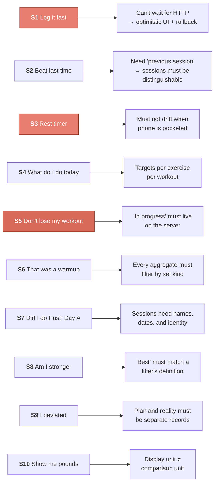
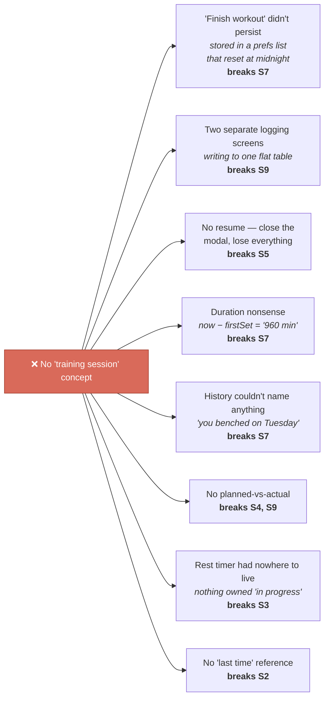

# Chapter 1 — What The Lifter Actually Needs

> Nothing in this codebase is justified by "good design." Every table, endpoint, and
> component in these docs traces back to something a person standing in a gym is
> trying to do. This chapter establishes those needs. **Every later chapter is
> accountable to them.**

---

## 1.1 Meet the user

Jordan is in a gym. Phone in one hand, chalk on the other. They have just finished a
set of bench press and have roughly **90 seconds** before the next one.

That's the design constraint. Not "clean architecture." Ninety seconds, one thumb,
sweaty screen, spotty Wi-Fi, and a person whose attention is on their next set — not
on your app.

Everything below is written from Jordan's point of view, in Jordan's words.

---

## 1.2 The ten stories

Ranked by how often Jordan needs them. Frequency matters enormously — it decides where
we're allowed to spend complexity and where we must spend *simplicity*.

| # | Jordan says… | Frequency | Demands |
|---|---|---|---|
| **S1** | "I just did 185 for 8. Record it. **Fast.**" | ~30×/workout | Sub-second logging, no waiting on network |
| **S2** | "What did I lift last time? I want to beat it." | ~8×/workout | Previous session's numbers, per exercise, on screen |
| **S3** | "Start my 90-second rest. Tell me when." | ~30×/workout | A timer that survives me putting the phone down |
| **S4** | "Tell me what I'm supposed to do today." | 1×/workout | Prescribed sets/reps/rest per exercise |
| **S5** | "I got a phone call / my phone died. **Don't lose my workout.**" | occasional, catastrophic | Durable in-progress state, server-side |
| **S6** | "That was a warmup. Don't count it." | ~5×/workout | A working/warmup distinction that aggregates respect |
| **S7** | "Did I actually do Push Day A on Tuesday?" | weekly | Named, dated, durable session records |
| **S8** | "Am I getting stronger?" | weekly | PRs and trends that mean what a lifter thinks they mean |
| **S9** | "I skipped an exercise and added a different one." | ~1 in 3 workouts | Deviation from the plan without breaking the plan |
| **S10** | "I lift in pounds. Show me pounds." | once, then forever | Unit preference that never corrupts stored data |

And one story from the other side of the app:

| # | The coach/admin says… | Demands |
|---|---|---|
| **S11** | "Bench is 5×5 on strength day and 3×12 on volume day." | Prescription attached to *(workout, exercise)*, not to the exercise |

> ### 🎓 Why rank by frequency?
> S1 happens **30 times per workout**. S7 happens once a week. That's a ~200×
> difference, and it licenses very different engineering. We will spend real
> complexity making S1 instant (optimistic updates, a whole rollback mechanism) and
> deliberately *decline* the same complexity for rarer actions. A design that treats
> all features as equally important spends its budget in the wrong places.

---

## 1.3 What each story forces

Read this as: *requirement → consequence.* No architecture yet, just implications.



---

## 1.4 The discovery

Now look at what **S2, S5, S7, and S9** need, side by side:

- **S2** — "what did I lift *last time*" needs the concept of a *previous* training bout.
- **S5** — "don't lose my workout" needs *this* bout to exist somewhere durable.
- **S7** — "did I do Push Day A on Tuesday" needs the bout to have a *name* and a *date*.
- **S9** — "I deviated from the plan" needs the *plan* and the *bout* to be different things.

All four are asking for the same missing noun: **a training session.**

Here's why that matters. The app's original schema had this:

```
sets(id, user_id, date, exercise_id, weight, reps, timestamp)
```

Perfectly reasonable-looking. And it can answer S1 (log a set) and S8 (max weight)
just fine. But watch it fail S7. Jordan asks *"did I do Push Day A on Tuesday?"* and
the table says:

| date | exercise | weight | reps |
|---|---|---|---|
| Tue | Bench Press | 185 | 8 |
| Tue | Overhead Press | 95 | 10 |
| Tue | Cable Fly | 30 | 15 |

**Was that Push Day A?** Unanswerable. You can *guess* by pattern-matching against
your templates, but:

- Jordan skipped an exercise (**S9**) → doesn't match, still was Push Day A.
- Jordan added an exercise (**S9**) → doesn't match, still was Push Day A.
- Jordan did Push Day A *and* 10 minutes of accessories → two things, one bucket.
- Jordan did Push Day A **twice** that day → indistinguishable.

The answer was never recorded. No amount of clever querying recovers it, because the
thing Jordan is asking about — *a bout of training, which was an instance of a plan,
which started at one time and ended at another* — was never represented.

### The tell: eight bugs, one cause

Before this rewrite, the app had a defect list that read like an unrelated grab bag.
Here it is, mapped to the stories each one broke:



**This is the most important diagram in these docs.** Eight tickets. A team could burn
a sprint fixing them one at a time — special-casing duration, bolting a `workout_name`
column onto the sets table, stashing in-progress state in AsyncStorage — and still not
answer *"did I do Push Day A on Tuesday?"*

They are one bug. Six of Jordan's ten stories were unsatisfiable, and the cause was a
single absent noun.

> ### 🎓 The transferable lesson
> When multiple bugs resist clean individual fixes, stop fixing them and go back to
> the user stories. Ask: **which noun does the user use constantly that has no
> representation in my schema?** Jordan says "my Tuesday workout" and means a
> *thing*. If the database has no such thing, you will fight that gap forever — one
> patch per story, none of them quite working.

---

## 1.5 The answer, now earned

```python
class WorkoutSession(SQLModel, table=True):
    id: str                      # "ses-<uuid4 truncated>"
    user_id: str
    workout_id: str | None       # the plan it came from — None if ad-hoc  (S9)
    name: str                    # snapshot, so history can name it       (S7)
    local_date: str              # the day Jordan thinks it was           (S7)
    tz_offset_min: int
    started_at: str              # UTC — real duration, real ordering     (S7)
    ended_at: str | None         # None = still going                     (S5)
    status: str                  # active | completed | abandoned         (S5)
    notes: str | None
```

Every column has a story number next to it. That's not decoration — it's the standard
this codebase is held to. A column that can't name the story it serves is a column
that shouldn't exist.

Walk the stories back:

| Story | How the session satisfies it |
|---|---|
| **S2** "beat last time" | "most recent *other* session containing this exercise" is now a query |
| **S5** "don't lose my workout" | `status='active'` on the server. Phone dies, session lives |
| **S7** "did I do Push Day A" | `name` + `local_date` + `ended_at − started_at` |
| **S9** "I deviated" | `workout_id` is the plan; the session's sets are the reality |
| **S3** rest timer | the active session is the thing that owns "in progress" |
| **S4** what do I do today | prescriptions hang off `workout_id` |

---

## 1.6 Two decisions worth pausing on

Both follow from the stories, not from taste.

### `workout_id` is nullable — because of S9

Jordan sometimes walks in with no plan. That's the "Start empty workout" path, and it
means `workout_id = None`.

The tempting alternative is to require a plan and auto-create a throwaway one. **Don't.**
Plans are curated content a coach edits (**S11**); sessions are Jordan's history.
Merging them means the workout catalog slowly fills with thousands of single-use
garbage rows, and every "show me my workouts" query has to filter them out. A nullable
foreign key is the honest encoding of "this genuinely had no plan."

### `name` is copied, not joined — because of S7

```python
name: str    # snapshot at start; the workout may be renamed later
```

Deliberate denormalization, and normally you'd flag it in review. The reason is S7: if
the coach renames *"Upper Body Power"* to *"Push A"* next month, Jordan's session from
last month should still say what it said **at the time**. Joining to `workouts.name`
would silently rewrite Jordan's own history.

> ### 🎓 The transferable lesson
> Normalize **facts**. Denormalize **historical records**. An invoice keeps the price
> you paid, not today's price. A session keeps the name it had, not today's name. When
> the row is a record of something that *happened*, a copy is more correct than a
> reference.

---

## 1.7 The traceability matrix

This is the contract for the rest of the documentation. Every story, where it's
implemented, and whether it's actually verified.

| Story | Lives in | Verified? |
|---|---|---|
| **S1** log fast | `useLogSet` optimistic path → [Ch 5](05-the-hard-parts.md#54-optimistic-updates-lying-to-the-user-correctly) | ⚠️ Type-checked only |
| **S2** beat last time | `_last_time_sets` → [Ch 4](04-session-lifecycle.md#46-one-request-renders-the-whole-screen) | ✅ `test_last_time_populated_from_prior_session_only` |
| **S3** rest timer | `use-rest-timer.ts` → [Ch 5](05-the-hard-parts.md#55-the-rest-timer-why-not-setintervalcount--) | ⚠️ Needs a device |
| **S4** what do I do today | `workout_exercise_link` targets → [Ch 3](03-data-model.md#34-workout_exercise_link--a-join-table-that-grew-opinions) | ✅ `test_workout_detail_includes_prescriptions` |
| **S5** don't lose my workout | `WorkoutSession.status` → [Ch 4](04-session-lifecycle.md) | ✅ server-side; ⚠️ needs device confirmation |
| **S6** that was a warmup | `HistoricalSet.kind` + `prs.py` → [Ch 3](03-data-model.md#why-kind-working--warmup) | ✅ `test_log_set_warmup_excluded_from_pr_and_volume` |
| **S7** did I do Push Day A | `WorkoutSession` name/date → [Ch 1](#15-the-answer-now-earned) | ✅ `test_list_sessions_summary_shape` |
| **S8** am I stronger | `personal_records` two bests → [Ch 3](03-data-model.md#33-personal_records--two-bests-not-one) | ✅ `test_log_set_best_weight_beats_best_volume` |
| **S9** I deviated | ad-hoc block assembly → [Ch 4](04-session-lifecycle.md#45-block-assembly--the-cleverest-function-in-the-backend) | ✅ `test_blocks_ordering_prescribed_then_adhoc` |
| **S10** show me pounds | `weight` / `weight_unit` / `weight_kg` → [Ch 3](03-data-model.md#why-weight-weight_unit-and-weight_kg) | ✅ `test_log_set_mixed_units_compare_on_kg` |
| **S11** per-workout prescriptions | prescription on the join table → [Ch 3](03-data-model.md#34-workout_exercise_link--a-join-table-that-grew-opinions) | ✅ `test_workout_detail_includes_prescriptions` |

Note that the three ⚠️ rows are all **client-side**. That's the real shape of this
codebase's risk, and [Chapter 7](07-testing.md) is blunt about it.

---

## Where to go next

[Chapter 2 — From Stories to Architecture](02-system-architecture.md): how S1 and S5,
pulling in opposite directions, produce every layer boundary in the app.
