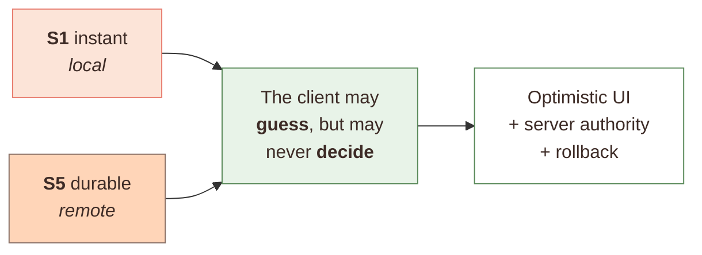
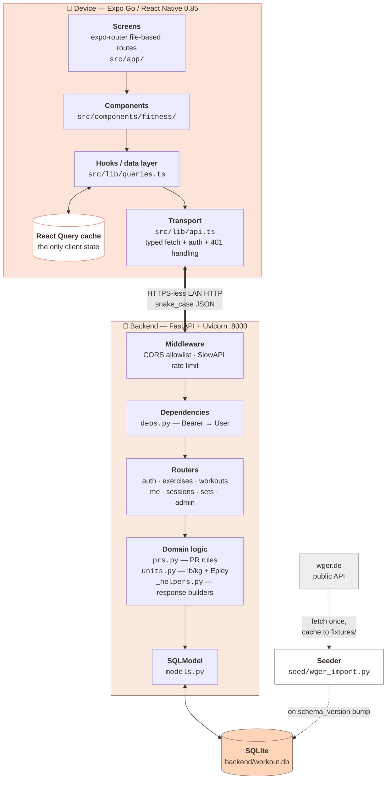
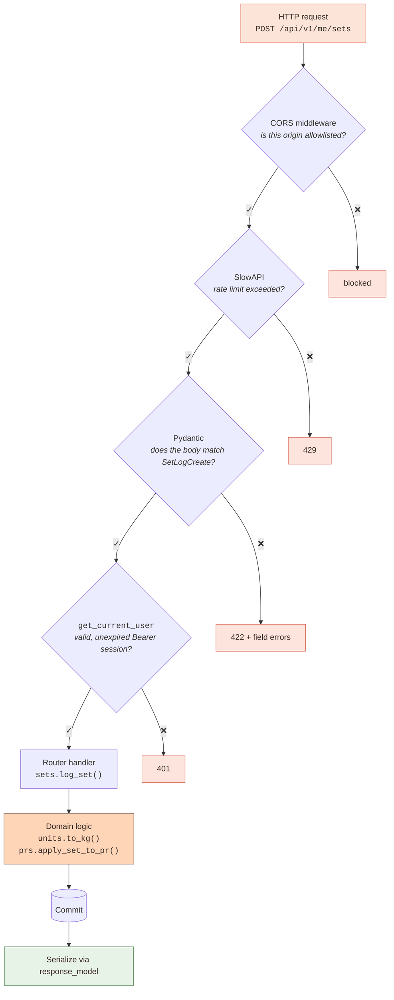
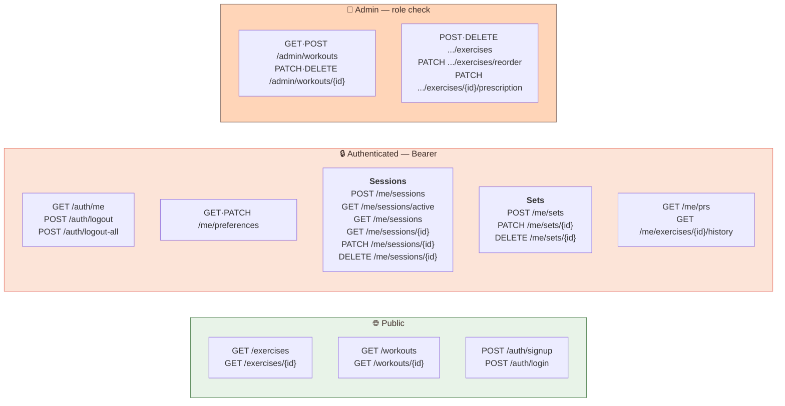
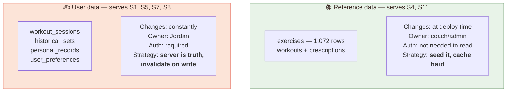

# Chapter 2 — From Stories to Architecture

> Two of Jordan's stories pull in **opposite directions**. Resolving that tension is
> what produces every layer boundary in this app.

---

## 2.0 The tension that shapes everything

Put two stories from [Chapter 1](01-what-the-lifter-needs.md) next to each other:

> **S1** — *"I just did 185 for 8. Record it. **Fast.**"* (30× per workout)
>
> **S5** — *"My phone died. **Don't lose my workout.**"*

**S1 says: don't wait for the server.** Thirty times a workout, on gym Wi-Fi, a 300 ms
round trip before the row appears is unbearable. The UI has to respond instantly.

**S5 says: the server is the only thing you can trust.** Local state dies with the app.
If "in progress" lives only on the phone, a dead battery erases the workout.

These are in direct conflict. Instant means local; durable means remote.

The resolution is the single most important idea in the app's architecture:



The client shows the set immediately (**S1 satisfied**) while the server remains the
sole authority on what actually happened (**S5 satisfied**). If the server disagrees,
the client's guess is discarded.

Every layer boundary below exists to keep that distinction crisp.

---

## 2.1 The 10,000-foot view



## 2.2 Who is allowed to be wrong?

The S1/S5 resolution, made concrete:

| Layer | Authority | Allowed to be wrong? | Because |
|---|---|---|---|
| SQLite | **Truth** | No | S5 — this is what survives a dead battery |
| FastAPI domain logic | Computes truth | No | S8 — a PR must mean one thing |
| React Query cache | *Believes* truth | **Yes — temporarily** | S1 — speed requires guessing |
| Component state | Draft user input | Yes, freely | Jordan is mid-typing |

What the client is *never* permitted to do is **compute** something authoritative.
Notice what's deliberately absent from the frontend, and which story protects it:

- It does not decide whether a set is a PR — `prs.py` does. (**S8**: "am I stronger"
  can't have two answers.)
- It does not compute `weight_kg` — `units.py` does. (**S10**: pounds and kilos must
  compare correctly forever.)
- It does not assign `set_index` — the `sets` router does. (Two devices would both
  pick "index 3".)
- It does not decide what day a session belongs to — it *reports* its local date and
  the server stores what it's told. (**S7**, and see
  [Ch 5](05-the-hard-parts.md#51-time-zones-the-bug-that-was-live-in-production).)

> ### 🎓 The transferable lesson
> "Client-side validation for UX, server-side validation for truth" is the version
> everyone knows. The stronger version: **any value two clients could disagree about
> must be computed in exactly one place.** Two phones, two time zones, one `weight_kg`
> formula on the server → they agree. Put that formula on the client and eventually
> they won't.

## 2.3 Backend layers, and why each exists



**The ordering is the design.** Cheap rejections happen before expensive ones:

1. **CORS** — a string comparison. Reject hostile origins for free.
2. **Rate limit** — an in-memory counter. Reject floods before touching the DB.
3. **Pydantic** — pure CPU. Reject malformed bodies before a DB round trip.
4. **Auth** — *this* one hits the database (session lookup). It's the most expensive
   gate, so it goes last.

Getting this backwards — authenticating before validating the body — means an
attacker can make you do a DB query with a garbage payload. Cheap checks first is
both faster and safer.

## 2.4 Why `deps.py` is a dependency and not middleware

Middleware runs on *every* request. Auth doesn't apply to every request — `GET
/exercises` is public, `GET /me/sessions` is not, `POST /admin/workouts` needs a role.

FastAPI's dependency injection lets authorization be **declared per-route**:

```python
# Public — no auth dependency at all
@router.get("/exercises")
def list_exercises(session: Session = Depends(get_session)): ...

# Authenticated
@router.get("/sessions/active")
def get_active_session(user: User = Depends(get_current_user)): ...

# Admin only — applied to the whole router
router = APIRouter(prefix="/workouts", dependencies=[Depends(require_admin)])
```

That last line is worth noticing. Every admin route is gated by construction. You
cannot add an unprotected route to `admin.py` by forgetting a decorator, because the
gate is on the router, not the handler. **Making the secure thing the default is
better than remembering to be secure.**

`require_admin` returns **403, not 401** — a deliberate distinction:

- **401 Unauthorized** = "I don't know who you are." → client should re-login.
- **403 Forbidden** = "I know exactly who you are; you're not allowed." → re-login
  won't help.

Conflating them sends users into a pointless login loop.

## 2.5 The complete route map



### ⚠️ A subtle trap: route declaration order

In [`sessions.py`](../backend/app/routers/sessions.py), these two routes exist:

```python
@router.get("/sessions/active")        # declared at line ~321
@router.get("/sessions/{session_id}")  # declared at line ~357
```

FastAPI matches routes **in declaration order**. The string `"active"` is a perfectly
valid `{session_id}`, so if `/sessions/{session_id}` were declared first, a request to
`/me/sessions/active` would be routed to `get_session_detail(session_id="active")`,
which would look up a session with the literal id `"active"`, find nothing, and
return **404 forever**.

The specific route must be declared before the parametrized one. This is invisible
in the code unless you know to look for it — which is exactly why it's documented
here.

> ### 🎓 The transferable lesson
> Any time a URL segment can be either a literal or a variable, ordering is
> load-bearing and silent when wrong. Static segments before dynamic ones, always.

## 2.6 Two kinds of data, two strategies

Compare **S4** ("tell me what to do today") with **S1** ("record this set"). The first
reads content a coach authored months ago. The second writes Jordan's own history,
thirty times an hour. Those aren't the same kind of data, and treating them the same
is how you end up with either a slow catalog or a stale workout.

This distinction is also why the app did *not* migrate to a BaaS like Supabase — see
the note at the end of this section.



This shows up directly in cache policy in `queries.ts`, and each number is a story
decision, not a guess:

```ts
useExercises     → staleTime: ONE_HOUR  // S4: the catalog barely changes
useWorkouts      → staleTime: FIVE_MIN  // S11: a coach might have just edited it
useActiveSession → staleTime: 0         // S5: never show a stale "no workout"
```

`staleTime: 0` on the active session is the point, not laziness. **S5** is the
catastrophic story — if Jordan reopens the app after a crash and we serve a cached
"no active session" from 60 seconds ago, we've shown them the workout picker and
effectively told them their workout is gone. That's the exact failure S5 exists to
prevent, so this cache never gets to be stale.

---

## Where to go next

[Chapter 3 — The Data Model](03-data-model.md) goes column by column.
