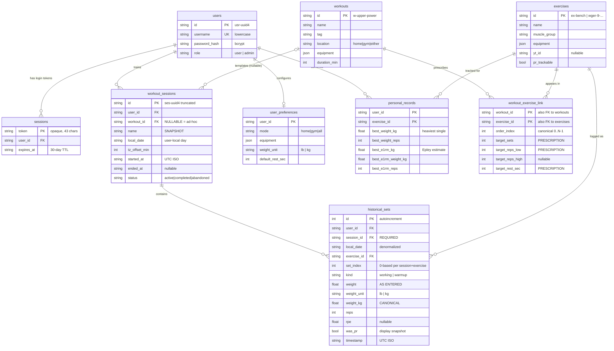
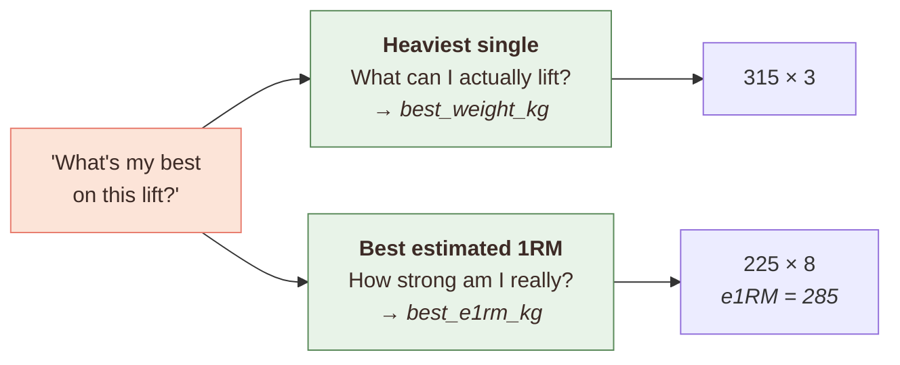
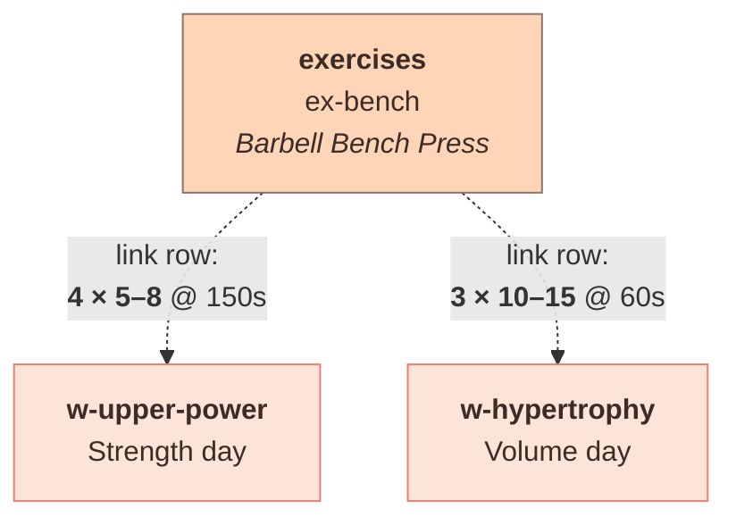

# Chapter 3 — The Data Model

> Everything here lives in [`backend/app/models.py`](../backend/app/models.py). The rule
> for this chapter: **no column gets defended on aesthetic grounds.** Each one names
> the story from [Chapter 1](01-what-the-lifter-needs.md) that forced it into
> existence. If a column can't name its story, it shouldn't be there.

---

## 3.1 The whole picture



Nine tables. Let's justify the interesting ones.

---

## 3.2 `historical_sets` — the column-by-column argument

This table is where **S1** (log fast), **S6** (that was a warmup), **S8** (am I
stronger), and **S10** (show me pounds) all land at once. It has the most non-obvious
decisions in the schema, and every one of them is traceable.

### Why `weight`, `weight_unit`, **and** `weight_kg`?

> **The story:** **S10** — *"I lift in pounds. Show me pounds."* combined with
> **S8** — *"Am I getting stronger?"*

Three columns for one number looks like bloat until you notice those two stories want
different things from it. Jordan wants to *see* `135`. The PR engine needs to *compare*
across units. Serve one and you break the other.

```python
weight: float                    # 135.0     — what the user typed
weight_unit: str                 # "lb"      — the unit they typed it in
weight_kg: float = Field(index=True)  # 61.234... — canonical, for comparison
```

**The naive design** stores one canonical number and converts for display:

```
store 61.23496 kg  →  display as 135.0 lb
```

This works arithmetically and fails in practice. Consider a user who lifts in pounds:

| They loaded | Stored (kg) | Displayed back |
|---|---|---|
| 135 lb | 61.234968 | 135 lb ✓ |
| 137.5 lb | 62.369... | 137.5 lb ✓ |

Fine so far — but now you're one rounding decision away from showing `134.9` or
`135.00000001`, and every display site has to agree on the rounding. Worse, plate
math is *exact in its native unit*: 135 lb is a 45-lb bar plus two 45s. It is not
"approximately 61.2 kg." Storing the entered value means the number the user sees is
byte-for-byte the number they typed, forever, with no rounding policy to get wrong.

**The other naive design** stores only what the user typed. Now compare two sets:

```
Set A: 100 kg × 5
Set B: 220 lb × 5
```

Which is heavier? You cannot answer without converting — so now every PR query, every
volume sum, every sort has to convert on the fly, and any query that forgets is
silently wrong. This is a real trap: a user who switches units mid-training-block
gets a corrupted PR history.

**So we store both.** `weight` + `weight_unit` is the lossless record of user intent.
`weight_kg` is the derived comparison key, indexed, computed in exactly one place
([`units.py::to_kg`](../backend/app/units.py)), and recomputed on *every* write —
including `PATCH`:

```python
# sets.py — inside update_set()
# Any of the three fields above can change the canonical comparison
# value, so it's always re-derived rather than conditionally patched.
target.weight_kg = to_kg(target.weight, target.weight_unit)
```

That comment exists because the conditional version is the bug. If you only recompute
`weight_kg` when `weight` changes, then a `PATCH {"weight_unit": "kg"}` leaves a
stale `weight_kg` behind and the PR table quietly goes wrong.

> ### 🎓 The transferable lesson
> When a value has both a **presentation form** and a **comparison form**, store
> both and derive one from the other at a single choke point. Money does this
> (amount + currency + normalized). Time does this (local + UTC). Weight does this.
> The failure mode of picking only one is always the same: either lossy display or
> incorrect comparison.

### Why `kind: "working" | "warmup"`?

> **The story:** **S6** — *"That was a warmup. Don't count it."*

Warmups are real sets that must not count. If Jordan benches 135 × 5 as a warmup
before working up to 315, a schema without `kind` records a 135-lb set that:

- pollutes your volume total,
- appears in "last time" suggestions,
- and if it were your only set, would become your PR.

`kind` is the flag that lets `prs.py` and every aggregate filter them out. This is the
**single easiest thing to get wrong** in the whole codebase, which is why it's called
out in `prs.py`'s docstring:

```python
"""
Warmup sets (`kind == "warmup"`) never count towards either best and
are excluded from every volume total elsewhere in the codebase.
"""
```

### Why `set_index` is server-assigned

> **The story:** **S2** — *"What did I lift last time?"* needs "set 1, set 2, set 3"
> to mean something stable, so the prefill lines up slot-for-slot.

The client never sends it:

```python
set_index=_next_set_index(session, body.session_id, body.exercise_id),
```

Two reasons. First, two devices logging concurrently would both compute "index 3."
Second — and this is the interesting one — **deletion has to renumber.** Delete set 2
of 4 and you must not be left with `[0, 2, 3]`:

```python
def _renumber_set_index(session, session_id, exercise_id) -> None:
    """Rewrite every remaining set's `set_index` to 0..N-1, in current order."""
```

This mirrors `_renormalize_order_indexes` in `admin.py`, which does the same job for
exercise ordering within a workout. Same problem, same shape of solution — worth
noticing the parallel.

### Why `local_date` is copied from the session

> **The story:** **S7** — *"Did I do Push Day A on Tuesday?"* — where "Tuesday" means
> Jordan's Tuesday, not UTC's.

```python
local_date: str  # denormalized from the session
```

The set already belongs to a session, and the session has a `local_date` — so this is
redundant. It's here so that "give me every set in this date range" is a single
indexed scan instead of a join. A deliberate read-optimization.

The critical rule, from the code comment in `sets.py`:

```python
# `local_date` on a set is copied from its session — never recomputed
# from the timestamp.
```

Recomputing it from the UTC `timestamp` would reintroduce the exact time zone bug
this design exists to kill. See [Chapter 5](05-the-hard-parts.md#53-time-zones).

### Why order by `id`, not `timestamp`

> **The story:** **S9** — *"I skipped an exercise and added a different one."* The
> added exercise has to appear where Jordan put it, not in some arbitrary order.

This one was found by a failing test, not by inspection.

`utc_now_iso()` has **second** resolution: `2026-08-01T14:23:07Z`. Log two exercises
within the same second and their timestamps are byte-identical. A sort on
`timestamp` then falls back to whatever order SQLite feels like — which turned out to
be alphabetical by `exercise_id`.

The test that caught it:

```python
def test_blocks_ad_hoc_session_ordered_by_first_logged(...):
    # log ex-squat first, then ex-bench
    assert ids == ["ex-squat", "ex-bench"]
    # FAILED: got ["ex-bench", "ex-squat"]  ← alphabetical!
```

The fix, in `sessions.py`:

```python
# Ordered by `id` (the autoincrement PK), not `timestamp` — two
# sets logged within the same second get identical
# second-resolution timestamps, and a timestamp-string sort would
# silently tie-break to whatever order the *next* query happened
# to return them in. `id` is monotonically increasing at insert
# time regardless of clock resolution.
.order_by(HistoricalSet.id)
```

> ### 🎓 The transferable lesson
> **A timestamp is not an ordering key.** Clock resolution is finite, clocks go
> backwards (NTP, DST), and ties are silent. If you need insertion order, use the
> thing that is monotonic *by construction* — an autoincrement PK or a sequence.
> Note also: this bug was invisible to inspection and obvious to a test. That's the
> category of bug tests are actually for.

---

## 3.3 `personal_records` — two bests, not one

> **The story:** **S8** — *"Am I getting stronger?"*
>
> This is the story most easily broken by a plausible-looking implementation, because
> the bug produces a number rather than a crash — and a wrong number that Jordan
> immediately recognizes as absurd.

### The bug in the old design

The previous schema stored one PR per exercise, scored by `weight × reps`:

```python
if new_score > (existing.weight * existing.reps):   # ← the bug
```

Run the numbers:

| Set | Score | "PR"? |
|---|---|---|
| 135 lb × 20 | 2,700 | ✅ |
| 315 lb × 3 | 945 | ❌ |

**Jordan's 315 bench does not register as a PR, but a light set of 20 does.** Any lifter
would immediately call that broken — which is the point: S8 isn't satisfied by *a*
number, it's satisfied by a number that matches what a lifter means. And it got worse:
the *trophy* UI compared
`pr.weight >= threshold`, so the stored row — chosen for maximum volume — was checked
against a weight threshold. Two incompatible notions of "best" in one pipeline.

### The fix: Jordan was asking two different questions

When Jordan says *"what's my best bench?"* they could mean either of two things, and
both are legitimate:



These genuinely have different answers and **the winning set can differ.** 225 × 8 has
a higher Epley estimate than 235 × 1, while 235 × 1 is the heavier single. Collapsing
them into one number destroys information.

So the table tracks both, independently:

```python
best_weight_kg / best_weight_reps / best_weight_date       # heaviest single
best_e1rm_kg / best_e1rm_weight_kg / best_e1rm_reps / ...  # best Epley
```

And `is_pr` means "**either** best improved":

```python
improved = False
if (s.weight_kg, s.reps) > (pr.best_weight_kg, pr.best_weight_reps):
    ...
    improved = True
if e1rm > pr.best_e1rm_kg:
    ...
    improved = True
```

Note the **tuple comparison** `(weight, reps) > (best_weight, best_reps)`. Python
compares element-wise, so this reads as "heavier, or same weight for more reps."
That's the correct tie-break, and expressing it as a tuple is clearer than a nested
`if`.

### `was_pr` on the set is a *display* snapshot

```python
was_pr: bool = Field(default=False)  # snapshot at log time, for history badges
```

This is intentionally **not** the source of truth — `personal_records` is. It exists
so history can render a 🏆 badge on the row without recomputing PR state for every
set ever logged. It's a cache, and it's allowed to drift after edits and deletions.
The `update_set` handler is honest about this in a comment:

```python
# `was_pr` is a display snapshot, not the source of truth (the PR
# table is) — approximate "this row backs a current best" by value
# match rather than tracking set identity on PersonalRecord.
```

An alternative design would store `best_weight_set_id` on the PR row and make
`was_pr` exactly derivable. That's more correct and more schema; the badge isn't
worth it. **This is a documented, deliberate approximation** — the kind of tradeoff
worth writing down rather than discovering later and assuming it's a bug.

---

## 3.4 `workout_exercise_link` — a join table that grew opinions

> **The stories:** **S4** — *"Tell me what I'm supposed to do today"* and **S11** —
> the coach's *"bench is 5×5 on strength day and 3×12 on volume day."*

It started as a pure many-to-many with ordering. Now it carries the **prescription**:

```python
workout_id: str = Field(primary_key=True)
exercise_id: str = Field(primary_key=True)
order_index: int
target_sets: int = 3
target_reps_low: int = 8
target_reps_high: int | None = 12
target_rest_sec: int = 90
prescription_notes: str | None
```

**Why not put targets on `exercises`?** Because then bench press has exactly one
prescription globally, and this becomes impossible:



The same lift, prescribed two different ways. This is **S11** exactly, and it's the
*entire point* of programming a training block — heavy low-rep work on strength days,
higher volume on hypertrophy days. It only works if the prescription belongs to the
**(workout, exercise) relationship**, not to either one alone.

Notice what a coach would have to do otherwise: duplicate the exercise into
`ex-bench-heavy` and `ex-bench-light`. Now Jordan's bench PR is split across two
exercise ids and **S8 breaks** — "am I getting stronger at bench" has two separate
answers, neither complete. One bad modeling call cascades into a different story.

You can see it in the seed data ([`workout_seeds.py`](../backend/app/seed/workout_seeds.py)):

```python
# Compounds: lower reps, longer rest.
{"id": "ex-bench", "target_sets": 4, "target_reps_low": 5,  "target_reps_high": 8,  "target_rest_sec": 150},
{"id": "ex-ohp",   "target_sets": 4, "target_reps_low": 5,  "target_reps_high": 8,  "target_rest_sec": 150},
# Accessories: higher reps, shorter rest.
{"id": "ex-cable-fly", "target_sets": 3, "target_reps_low": 10, "target_reps_high": 15, "target_rest_sec": 60},
```

> ### 🎓 The transferable lesson
> When an attribute's correct value depends on *which relationship you're looking
> through*, it belongs on the join table. "What reps for bench?" has no answer.
> "What reps for bench **in this workout**?" does. If you find yourself wanting to
> duplicate an entity (`ex-bench-heavy`, `ex-bench-light`) to vary an attribute,
> that attribute belongs on the relationship.

### The API trick that made this cheap

Adding prescription fields to `WorkoutDetailResponse.exercises` is a breaking change —
unless you subclass:

```python
class WorkoutExerciseResponse(ExerciseResponse):   # ← subclass, not replacement
    order_index: int
    target_sets: int
    target_reps_low: int
    target_reps_high: int | None
    target_rest_sec: int
    prescription_notes: str | None
```

Mirrored in TypeScript:

```ts
export interface WorkoutExerciseResponse extends ExerciseResponse { ... }
```

Because it only **adds** fields, every existing consumer that reads `.name` or
`.yt_id` keeps compiling untouched. `WorkoutEditorModal` — 824 lines — needed no
signature changes to keep working. Structural subtyping did the work.

---

## 3.5 The `sessions` name collision (a readability trap)

There are two unrelated things called "session" in this codebase:

| Thing | Table | Meaning |
|---|---|---|
| `Session` | `sessions` | an **auth token** (login session) |
| `WorkoutSession` | `workout_sessions` | a **training session** |

Plus SQLModel's `Session` (a DB transaction). Three meanings, one word. The code
manages it with import aliasing:

```python
from sqlmodel import Session as SQLModelSession   # in admin.py / _helpers.py
```

and in `sessions.py`, the DB session parameter is named `db` rather than `session`
specifically to avoid shadowing:

```python
def get_active_session(user: User = Depends(get_current_user),
                       db: Session = Depends(get_session)):
```

If you're extending this code, keep that convention. It's the difference between
readable and maddening.

---

## Where to go next

[Chapter 4 — The Session Lifecycle](04-session-lifecycle.md) — the state machine, and
the edge cases that shaped it.
