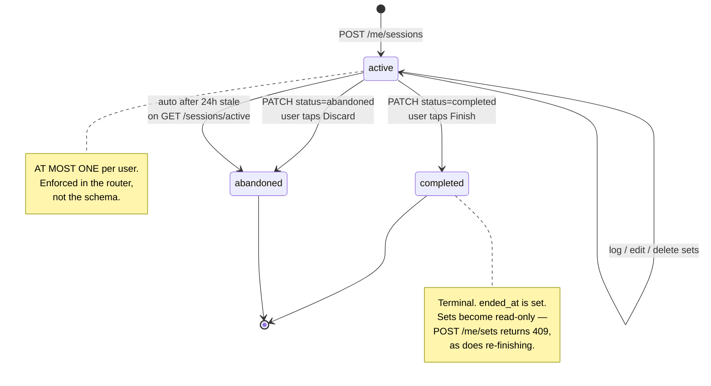
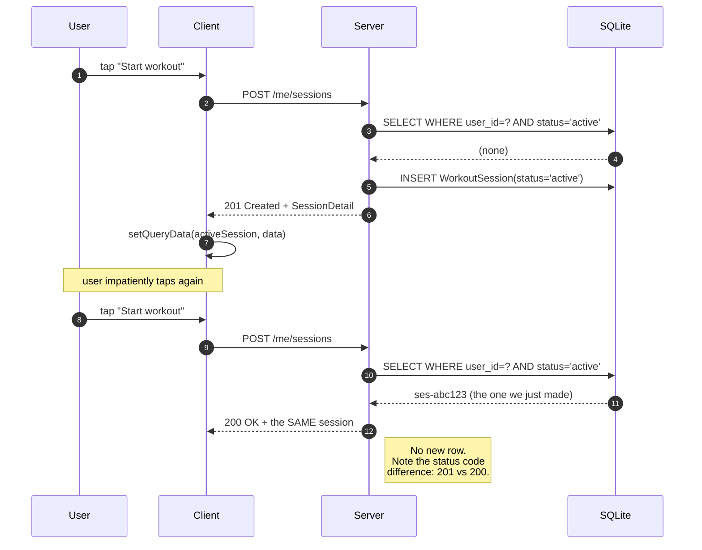
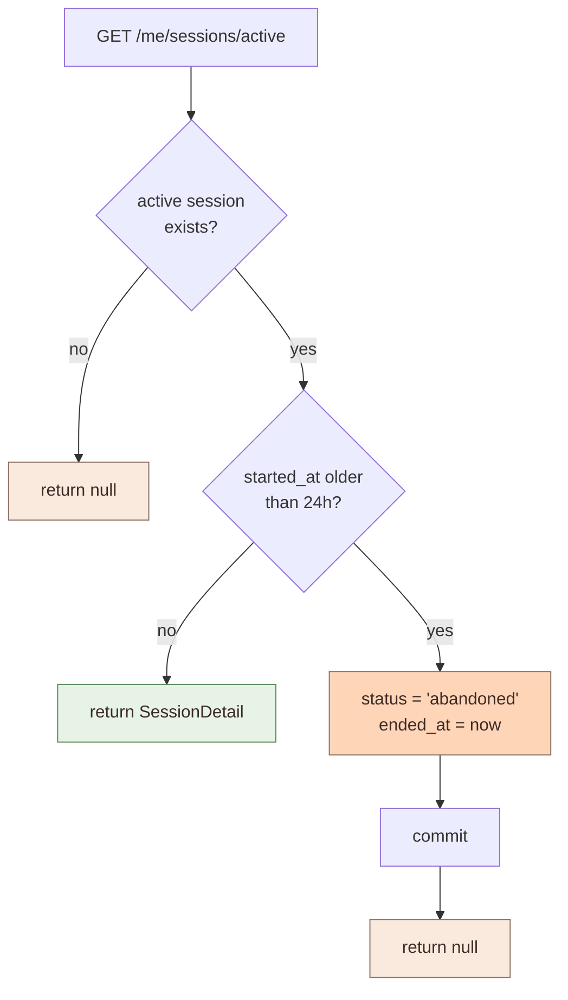
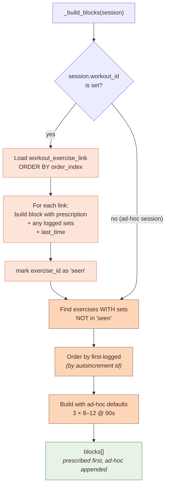
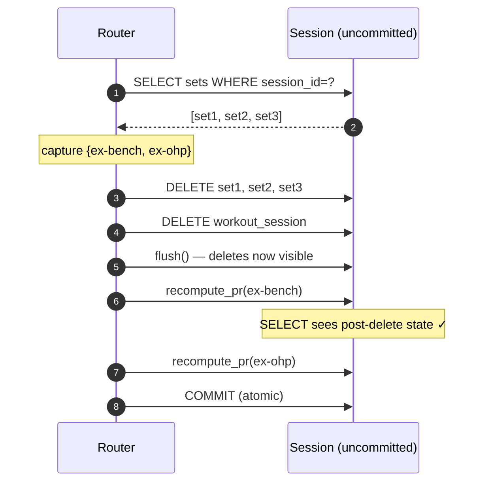

# Chapter 4 — The Session Lifecycle

> **The story:** **S5** — *"I got a phone call / my phone died. Don't lose my workout."*
>
> Three states sounds trivial. All the real engineering is in the things that happen to
> Jordan that nobody planned for: the double-tap, the dead battery, the workout
> abandoned three days ago and never mentioned again.

---

## 4.0 The four ways a workout ends

Before the state machine, the actual situations. Jordan's workout stops for one of
these reasons:

| What happens to Jordan | What the system must do |
|---|---|
| Finishes the last set, taps **Finish** | Record it. This counts. (**S7**, **S8**) |
| Decides 5 minutes in that they're too tired | Discard it. This must **not** count as training |
| Phone dies mid-workout, comes back 20 min later | **Resume it.** Everything still there (**S5**) |
| Phone dies mid-workout, never comes back | Clean up eventually, without trapping them |

That fourth row is the one people forget, and it's the reason `abandoned` exists as a
distinct state and why there's a sweeper. The rest of this chapter is those four rows
made mechanical.

---

## 4.1 The state machine



Three states, each earning its keep against a row from §4.0:

- **`active`** — accepting sets. Exactly one per user. This is what **S5** resumes.
- **`completed`** — Jordan finished. This is real training, and it's what **S7** and
  **S8** count.
- **`abandoned`** — Jordan bailed, or the app died and we swept up. Distinct from
  `completed` because **an abandoned session must not count as "you trained today."**
  Collapse these two and Jordan's adherence stats and calendar start lying — a 3-minute
  false start would look identical to a real session.

---

## 4.2 Starting a session: the idempotency problem

> **What happens to Jordan:** they tap "Start empty workout." Gym Wi-Fi. Nothing
> happens for a second. So they tap again — because that's what everyone does.

**Naive implementation:** two sessions. Now `GET /sessions/active` returns... which one?
Half of Jordan's sets go to each, **S7** reports two workouts on Tuesday, and **S5** has
no single thing to resume.

**The fix** is to make `POST /me/sessions` idempotent:



In code:

```python
existing = _get_active_session(db, user.id)
if existing is not None:
    response.status_code = status.HTTP_200_OK   # override the decorator's 201
    return build_session_detail(db, existing)
```

Two things worth noticing.

**First, the status code carries meaning.** `201 Created` means "a new resource
exists." `200 OK` means "here's the resource, nothing new happened." A client that
cares can tell the difference. This is what the HTTP spec is *for*, and it costs one
line.

**Second, the second call's arguments are ignored.** If you tap "Start empty workout"
and then tap the "Upper Body Power" card, you get your existing empty session back —
*not* a session with `workout_id` set. This is tested explicitly:

```python
def test_create_session_idempotent_returns_existing_active(...):
    r2 = seeded_client.post("/api/v1/me/sessions",
        json={"workout_id": "w-upper-power", ...})
    assert r2.status_code == 200
    assert r2.json()["id"] == first_id
    # The second call's workout_id is ignored — the existing active
    # session wins, unchanged.
    assert r2.json()["workout_id"] is None
```

Is that the right behavior? It's *a* defensible behavior, and it's the safe one:
silently mutating a live session's identity mid-workout would be worse. The
alternative — 409 and force the user to explicitly discard first — is arguably better
UX. **This is a real design fork, and the code picks the conservative branch.**

> ### 🎓 The transferable lesson
> "Create" endpoints on singleton-ish resources should be idempotent, because mobile
> networks retry and users double-tap. The general pattern: `POST` that finds an
> existing match returns it with `200` instead of creating a duplicate with `201`.

---

## 4.3 Why "one active session" is enforced in code, not schema

The obvious database-level enforcement is a **partial unique index**:

```sql
CREATE UNIQUE INDEX one_active_per_user
  ON workout_sessions(user_id) WHERE status = 'active';
```

The code deliberately doesn't do this, and says so:

```python
# Exactly one session per user may be `status == "active"` at a time
# (enforced in the router, not the schema — SQLite has no portable
# partial-unique-index syntax across our supported dialects).
```

The honest tradeoff:

| | Partial unique index | Router check |
|---|---|---|
| Correct under concurrency | ✅ Always | ⚠️ Race window between SELECT and INSERT |
| Portable SQLite → Postgres | ❌ Syntax differs | ✅ Plain Python |
| Error surface | `IntegrityError` to translate | Clean 200/201 |

**The race is real.** Two simultaneous `POST /me/sessions` could both see "no active
session" and both insert. In practice this needs two requests from one user within
milliseconds, and the damage is one orphan session the 24h sweeper eventually
abandons. For a single-user fitness app that's an acceptable exposure — but if this
ever goes multi-device, the index is the correct fix.

That's the sort of thing worth writing down *before* it bites someone.

---

## 4.4 The stale-session sweeper

> **What happens to Jordan:** they start a session at the gym. Phone dies. They don't
> open the app again for three days. This is row 4 of §4.0.

Without intervention that session is `active` forever, and Jordan is **trapped**: every
launch drops them into a three-day-old workout, and they can't start a fresh one because
the idempotency rule from §4.2 keeps handing back the zombie.

Note the irony — the mechanism that satisfies **S5** ("don't lose my workout") is
exactly what creates this trap. Durability without expiry becomes a cage.

The fix is a **lazy sweeper** on the read path:

```python
STALE_SESSION_HOURS = 24

@router.get("/sessions/active", response_model=SessionDetailResponse | None)
def get_active_session(user=..., db=...):
    active = _get_active_session(db, user.id)
    if active is None:
        return None
    if _hours_since(active.started_at) > STALE_SESSION_HOURS:
        active.status = "abandoned"
        active.ended_at = utc_now_iso()
        db.add(active)
        db.commit()
        return None
    return build_session_detail(db, active)
```



**Why lazy instead of a cron job?** Because a cron job needs a scheduler, a deployment
story, and monitoring. The only moment a stale session *matters* is when someone asks
for it — so clean it up then. Zero infrastructure, and the invariant "`GET /active`
never returns something older than 24 hours" holds by construction.

The cost: a `GET` has a write side effect, which is technically a violation of HTTP
semantics (`GET` should be safe/idempotent). It is idempotent in effect — running it
twice yields the same state — but a strict reading says this belongs in a `POST`.
**Documented deviation, taken knowingly.**

> ### 🎓 The transferable lesson
> Lazy cleanup on read ("garbage collect on access") beats scheduled cleanup whenever
> staleness only matters at read time. You trade a tiny bit of HTTP purity for
> deleting an entire piece of infrastructure. Cache expiry, session timeouts, and
> soft-delete purging all fit this pattern.

Tested by reaching into the DB to forge a stale row:

```python
def test_stale_active_session_auto_abandoned(seeded_client, user_bearer_headers, db_session):
    stale = (datetime.now(timezone.utc) - timedelta(hours=25)).strftime("%Y-%m-%dT%H:%M:%SZ")
    ws = db_session.get(WorkoutSession, session_id)
    ws.started_at = stale
    db_session.commit()

    assert seeded_client.get("/api/v1/me/sessions/active", ...).json() is None
    assert ...json()["status"] == "abandoned"
```

Note the `db_session` fixture — the test manipulates state the API can't produce.
That's a legitimate and often necessary testing technique for time-dependent logic.

---

## 4.5 Block assembly — where S4 and S9 collide

> **The stories:** **S4** — *"tell me what I'm supposed to do today"* — and **S9** —
> *"I skipped an exercise and added a different one."*

These two fight each other. S4 wants the screen to show **the plan**, including
exercises Jordan hasn't touched yet. S9 wants it to show **what actually happened**,
including things the plan never mentioned. The screen has to be both at once.

So a session's `blocks` contain two different kinds of exercise:

1. **Prescribed** — from the template. Must appear **with zero sets logged**, because
   that's the to-do list ("Bench: 4 × 5–8"). Serves **S4**.
2. **Ad-hoc** — Jordan added it. Exists *only because* it has sets. Serves **S9**.



The elegant part: **an ad-hoc session is just the second pass with an empty first
pass.** There's no separate code path — `workout_id is None` simply skips the
prescription loop and falls through. One function handles both, and the ordering
guarantee ("template order, then additions in the order you added them") is a
natural consequence rather than something special-cased.

Verified by the test that also caught the timestamp-ordering bug:

```python
def test_blocks_ordering_prescribed_then_adhoc(...):
    # start from w-upper-power, then log ex-pushup (not in the template)
    assert ids == ["ex-bench", "ex-ohp", "ex-incline-db",
                   "ex-cable-fly", "ex-lateral", "ex-pushup"]
    assert detail["blocks"][-1]["target_sets"] == 3  # ad-hoc default
```

---

## 4.6 One request renders the whole screen

> **The story:** **S2** — *"What did I lift last time? I want to beat it."*
>
> This is the feature lifters actually use most after logging itself. Progressive
> overload only works if you can see the number you're trying to beat, and it has to
> be on screen **before** Jordan starts the set — not one tap away.

`SessionDetailResponse` is deliberately fat:

```python
class SessionExerciseBlock(BaseModel):
    exercise: ExerciseResponse
    target_sets: int
    target_reps_low: int
    target_reps_high: int | None
    target_rest_sec: int
    sets: list[HistoricalSetResponse]       # this session
    last_time: list[HistoricalSetResponse]  # ← the expensive bit
```

`last_time` is "all sets from the most recent **other** session that included this
exercise." It's what powers the greyed-out prefill Jordan sees: *"last time: 185 × 8."*

Notice what would happen to **S1** (log fast) if this weren't embedded. The screen shows
5 exercises, so the client would fire:

```
GET /me/sessions/active
GET /me/exercises/ex-bench/last
GET /me/exercises/ex-ohp/last
GET /me/exercises/ex-incline-db/last
...
```

**A classic N+1.** On a gym Wi-Fi connection that's five sequential round trips before
the screen is usable. Embedding `last_time` in the parent response makes it one.

The implementation:

```python
def _last_time_sets(db, user_id, exercise_id, exclude_session_id):
    rows = db.exec(
        select(HistoricalSet)
        .where(HistoricalSet.user_id == user_id)
        .where(HistoricalSet.exercise_id == exercise_id)
        .where(HistoricalSet.session_id != exclude_session_id)   # ← "other"
        .order_by(HistoricalSet.timestamp.desc(), HistoricalSet.id.desc())
    ).all()
    if not rows:
        return []
    most_recent_session_id = rows[0].session_id
    same_session = [r for r in rows if r.session_id == most_recent_session_id]
    same_session.sort(key=lambda s: s.set_index)
    return same_session
```

The `!= exclude_session_id` filter is essential — without it, "last time" would show
you the sets you just logged *this* session, which is useless and confusing.

**The honest cost:** this runs once per block, so a 5-exercise session issues 5 of
these queries server-side. That's an N+1 *inside* the server — but a server-local
query against an indexed column is microseconds, versus a mobile round trip at tens
of milliseconds. **Moving an N+1 from the network to the database is a ~1000×
improvement**, and if it ever matters it can be collapsed into one windowed query.

> ### 🎓 The transferable lesson
> N+1 is not inherently a database problem — it's a *round-trip* problem, and it
> costs in proportion to the latency of the hop. Optimize the expensive hop first.
> Don't contort your server to avoid cheap local queries while leaving five network
> calls in place.

---

## 4.7 Deletion order matters

`DELETE /me/sessions/{id}` has to unwind carefully:

```python
sets = db.exec(select(HistoricalSet).where(...session_id == session_id)).all()
affected_exercise_ids = {s.exercise_id for s in sets}   # ① capture BEFORE deleting
for s in sets:
    db.delete(s)
db.delete(ws)
db.flush()                                              # ② push deletes to DB
for exercise_id in affected_exercise_ids:
    recompute_pr(db, user.id, exercise_id)               # ③ now recompute
db.commit()                                              # ④ one atomic commit
```

Each step is load-bearing:

1. **Capture affected exercises first.** After deletion you can't ask "which exercises
   did this session touch?" — the rows are gone.
2. **`flush()` before recomputing.** `recompute_pr` runs a `SELECT`. Without the
   flush, the pending deletes aren't visible to that query and it would happily
   recompute a PR from sets that are about to vanish.
3. **Recompute per exercise.** If your deleted session held your bench PR, the PR must
   fall back to the best remaining set — or be deleted entirely if none remain.
4. **One commit.** Either the whole unwind lands or none of it does. A crash mid-way
   must not leave a PR pointing at a deleted set.



> ### 🎓 The transferable lesson
> `flush()` vs `commit()` is one of the most misunderstood distinctions in ORMs.
> `flush()` sends pending SQL so *your own subsequent queries in this transaction*
> see it. `commit()` makes it durable and visible to everyone. When a cleanup routine
> reads state you just modified, you need `flush()` — and you almost never want a
> `commit()` in the middle of a multi-step operation, because that's where partial
> failures become permanent corruption.

---

## Where to go next

[Chapter 5 — The Hard Parts](05-the-hard-parts.md) — time zones, units, and optimistic
updates, i.e. the three things that generate the most bugs in apps like this.
