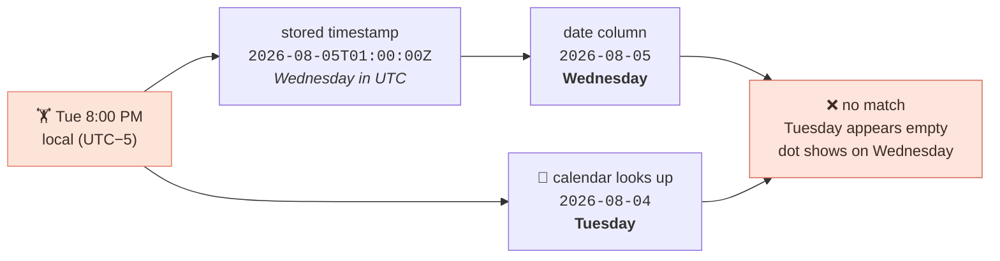
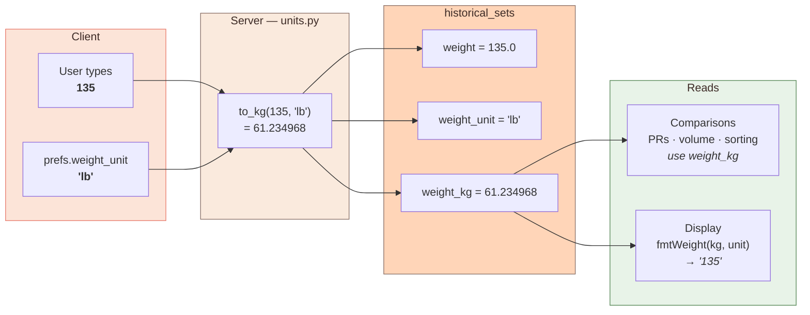
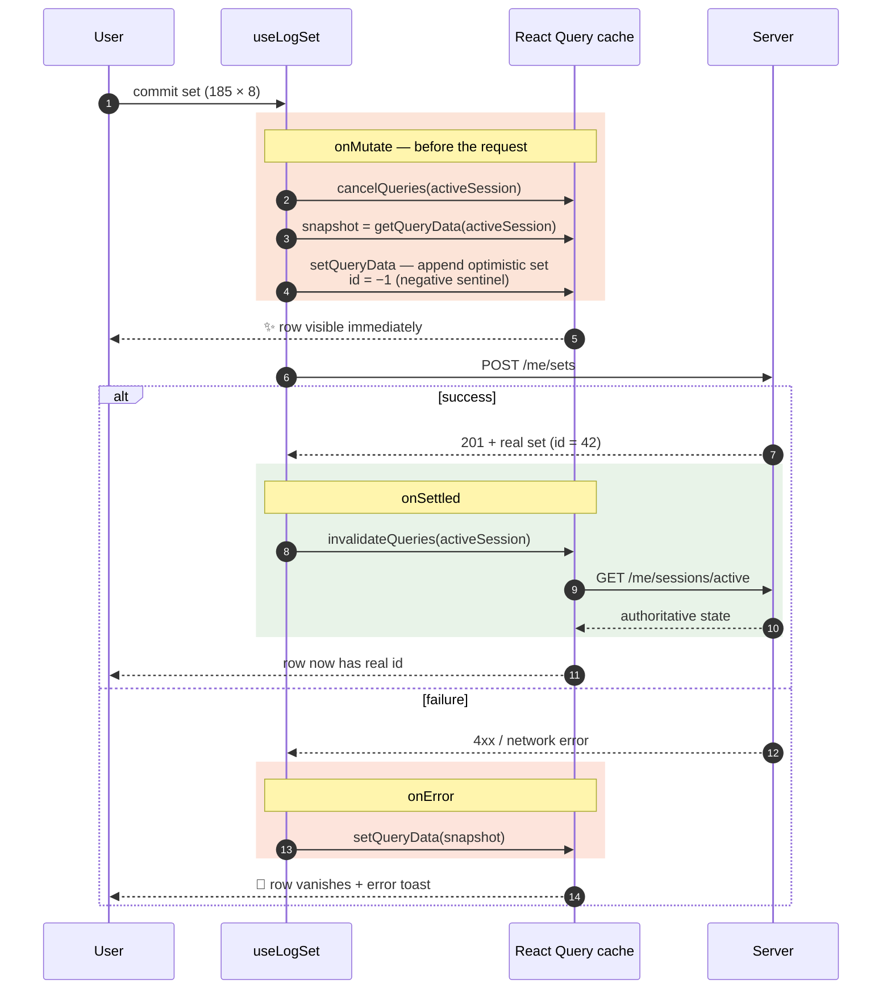

# Chapter 5 — The Hard Parts

> Four of Jordan's stories are the ones most likely to be implemented *plausibly but
> wrongly*: **S7** (which day was that), **S10** (pounds vs kilos), **S1** (log it
> fast), and **S3** (rest timer).
>
> They share a shape: a value exists in **two representations** — local and UTC,
> pounds and kilos, guessed and confirmed, elapsed and remaining — and something has
> to reconcile them. Every bug in this chapter is a reconciliation done badly.

Each section opens with Jordan's actual complaint, because that's how these bugs get
reported.

---

## 5.1 Time zones: the bug that was live in production

> **Jordan's complaint:** *"I trained Tuesday night. The calendar says Wednesday."*
>
> **The story it breaks:** **S7** — *"Did I do Push Day A on Tuesday?"*

### The setup

The old schema stored a set's day as:

```python
date = timestamp[:10]      # UTC ISO string, sliced to YYYY-MM-DD
```

Meanwhile `HistoryView` rendered its calendar from **local** dates:

```ts
const formatDate = (date: Date) => localDateKey(date);   // local
const hasHistory = datesWithHistory.has(formatDate(day)); // ← keys are UTC!
```

### Watch it break

Jordan is in New York (UTC−5) and trains Tuesday evening at 8:00 PM.



**Every evening workout was filed on the wrong day.** For a US user, that's most
workouts. The bug is invisible if you develop in UTC or test at 10 AM — which is
precisely why it survived.

### Why the obvious fixes are wrong

**"Just store local time."** Now you can't order events across time zones, and DST
gives you a duplicated hour every autumn where two different instants have the same
local string.

**"Just derive local from UTC on the client."** This *almost* works — every set carries
a full UTC timestamp, so `localDateKey(new Date(s.timestamp))` recovers the local day.
It's what the interim fix did. But it silently assumes **the device's current time
zone is the one the workout happened in.** Fly from New York to Tokyo and your
training history shifts by a day.

### The actual fix: store the human's answer

The client reports what day it *is*, for them, and the server stores that verbatim:

```python
class WorkoutSession(SQLModel, table=True):
    local_date: str      # YYYY-MM-DD in the USER's timezone
    tz_offset_min: int   # minutes east of UTC — kept for later reasoning
    started_at: str      # UTC ISO — for ordering and duration
```

Client side:

```ts
startSession.mutate({
  local_date: localDateKey(new Date()),          // "what day is it for me"
  tz_offset_min: -new Date().getTimezoneOffset(),  // note the negation
})
```

> **Why the minus sign?** JavaScript's `getTimezoneOffset()` returns *minutes to add to
> local time to get UTC* — so New York (UTC−5) returns `+300`. Every other system on
> earth expresses offsets as *minutes east of UTC*, where New York is `−300`. The
> negation converts JS's backwards convention to the normal one. This is a genuine
> footgun in the JS standard library.

And each set copies its session's `local_date` — never recomputing it:

```python
# `local_date` on a set is copied from its session — never recomputed
# from the timestamp.
local_date=ws.local_date,
```

Now both representations coexist with clear jobs:

| Column | Job | Never used for |
|---|---|---|
| `local_date` | grouping, calendars, "which day" | ordering |
| `started_at` (UTC) | ordering, duration, "which instant" | grouping |

The calendar becomes a direct comparison, no conversion anywhere:

```ts
const { data: monthSessions } = useSessions(monthStart, monthEnd);
const datesWithHistory = new Set((monthSessions ?? []).map((s) => s.local_date));
// ...
const hasHistory = datesWithHistory.has(localDateKey(day));  // local vs local ✓
```

> ### 🎓 The transferable lesson
> **"What time did this happen?" and "what day does the user think this was?" are
> different questions with different correct answers.** UTC answers the first. Only
> the client can answer the second, because the answer depends on a human's location
> and intent. Store both. Never derive one from the other after the fact.
>
> This generalizes: birthdays, calendar events, and "daily" streaks are all local-date
> problems, not instant problems. Storing a birthday as a UTC timestamp is the same
> bug.

---

## 5.2 Units: one number, two jobs

> **Jordan's complaint:** *"I switched to kilos and now my bench PR is wrong."*
>
> **The stories it breaks:** **S10** — *"show me pounds"* — and **S8** — *"am I getting
> stronger."*

Covered structurally in [Chapter 3](03-data-model.md#why-weight-weight_unit-and-weight_kg);
here's the data flow.



The whole conversion surface is eight lines
([`backend/app/units.py`](../backend/app/units.py)):

```python
KG_PER_LB = 0.45359237     # exact by international definition, not approximate

def to_kg(weight: float, unit: str) -> float:
    if unit == "kg": return weight
    if unit == "lb": return weight * KG_PER_LB
    raise ValueError(f"Unknown weight unit: {unit!r}")
```

Two details worth noticing:

**It raises on unknown units** rather than defaulting to one. A silent default here
would corrupt data — if a typo'd `"lbs"` fell through to "treat as kg," you'd store a
2.2× error. Pydantic already guards the boundary with `pattern="^(lb|kg)$"`, so this
is defense in depth: the validator stops bad input, and the raise catches any internal
caller that bypasses it.

**`0.45359237` is exact.** The international pound is *defined* as exactly
0.45359237 kg. This isn't a rounded constant, which means `to_kg`/`from_kg` round-trip
cleanly within float precision — tested:

```python
# from_kg(to_kg(135,"lb"), "lb") round-trips to 135.0 within 1e-9
```

### The mixed-unit test that proves it works

```python
def test_log_set_mixed_units_compare_on_kg(...):
    # 100 kg × 5
    # then 220 lb × 5  ≈ 99.79 kg  — must NOT be a PR
    assert r.json()["is_pr"] is False
    assert pr["best_weight_kg"] == 100.0
```

220 lb is *nearly* 100 kg but slightly less. Without `weight_kg`, a naive
`weight > best_weight` comparison sees `220 > 100` and declares a PR. This test is the
guard against exactly that.

---

## 5.3 Estimated 1RM: why Epley, and why it's a *display* value

```python
def epley_e1rm_kg(weight_kg: float, reps: int) -> float:
    if reps <= 1:
        return weight_kg          # a single IS your 1RM, don't "estimate" it
    return weight_kg * (1 + reps / 30)
```

The `reps <= 1` guard matters. Plugging `reps=1` into the formula gives
`w × (1 + 1/30) = 1.033w` — claiming your 1RM is 3% *higher* than the single you
actually just lifted. Nonsense. A 1-rep set is not an estimate.

Epley is one of several formulas (Brzycki, Lombardi, Wathen) and they disagree,
especially above ~10 reps. Epley is chosen because it's the most widely used, so
numbers here match what users see in other apps. It is a **heuristic, not a
measurement** — appropriate for progress tracking and trophies, and it's why
`best_e1rm_kg` is tracked *alongside* `best_weight_kg` rather than replacing it.

Note the deliberate duplication: `units.py` and
[`src/lib/e1rm.ts`](../src/lib/e1rm.ts) implement the same formula. The TS copy is
flagged as display-only:

```ts
/** Mirrors `backend/app/units.py::epley_e1rm_kg` — client-side use is display
 * only (e.g. a progress chart); the server's PR table is authoritative. */
```

Duplicated logic is normally a smell. Here it's a conscious call: charting e1RM per
set client-side would otherwise need a round trip per point. The mitigation is the
comment naming the server as authoritative, so the two can never *meaningfully*
diverge — if they disagree, the server wins by definition.

---

## 5.4 Optimistic updates: lying to the user, correctly

> **Jordan's requirement:** *"I just did 185 for 8. Record it. **Fast.**"* — 30 times a
> workout, on gym Wi-Fi.
>
> **The story:** **S1**, the highest-frequency story in the app. This is where the
> complexity budget gets spent, and §1.2 is the justification.

This is the most intricate client-side code in the app
([`src/lib/queries.ts`](../src/lib/queries.ts)) and the only place it earns that
intricacy is frequency. Thirty round trips per workout at 300 ms each is 9 seconds of
Jordan staring at a spinner between sets.

### The goal

Tap ✓ on a set. The row appears **instantly**, before any network activity. If the
server later rejects it, the row disappears and a toast explains why.

### The mechanism



### Why `cancelQueries` comes first

```ts
await qc.cancelQueries({ queryKey: queryKeys.activeSession });
```

Suppose a background refetch of `activeSession` is already in flight. It was issued
*before* your optimistic write. If it lands *after*, it overwrites your optimistic set
with a server response that predates it — and the row flickers out. Cancelling first
closes that window.

### Why optimistic IDs are negative

```ts
let nextOptimisticId = -1;
function getNextOptimisticId(): number {
  return nextOptimisticId--;
}
```

The original approach used `Date.now()`, which **collides if the user taps twice in the
same millisecond** — two rows with the same React `key`, which is a rendering bug.

A monotonic negative counter is collision-free for the session and, more importantly,
*self-describing*: `id < 0` means "not yet confirmed by the server." Consumers guard on
it:

```tsx
const isOptimistic = set.id < 0;
// ...
<Pressable onPress={onDelete} disabled={isOptimistic} />
```

```ts
const onUpdateSetFn = (id: number, ...) => {
  if (id < 0) return; // optimistic placeholder, server response is about to replace it
```

Without this guard, editing an optimistic row would fire `PATCH /me/sets/-1` → 404.

> ### 🎓 The transferable lesson
> A sentinel value should be **impossible in the real domain** and should encode its
> own meaning. Server IDs are positive autoincrements, so negatives are unambiguous
> and self-documenting. `Date.now()` fails both tests: it collides, and it looks like
> a plausible real ID. `null` is a common alternative but forces the ID type to be
> nullable everywhere.

### Rollback via snapshot, not inverse operations

`onError` restores a whole snapshot:

```ts
onMutate: async (body) => {
  const snapshot = qc.getQueryData<SessionDetailResponse | null>(queryKeys.activeSession);
  // ... mutate ...
  return { snapshot };
},
onError: (_err, _vars, ctx) => {
  if (ctx?.snapshot !== undefined) {
    qc.setQueryData(queryKeys.activeSession, ctx.snapshot);
  }
},
```

The alternative — applying an inverse operation ("remove the set I added") — is
fragile, because concurrent mutations mean the state you're inverting may have moved.
Snapshot-and-restore is coarser and always correct.

Note `ctx?.snapshot !== undefined` rather than a truthiness check: the snapshot can
legitimately be `null` (no active session), and `if (ctx?.snapshot)` would skip the
restore in that case.

### The aggregates must move too

A subtle piece — the optimistic update maintains `total_sets` and `total_volume_kg`
by hand, and respects the warmup rule:

```ts
const isWorking = kind === "working";
return {
  ...old,
  blocks,
  total_sets: isWorking ? old.total_sets + 1 : old.total_sets,
  total_volume_kg: isWorking
    ? old.total_volume_kg + weightKg * body.reps
    : old.total_volume_kg,
};
```

Miss this and the header counter freezes until the refetch lands — a visible glitch.
Get the warmup condition wrong and the client briefly disagrees with the server about
volume.

### The one non-optimistic case, documented

```ts
/**
 * If the exercise has no block yet (the very first set of a brand-new
 * ad-hoc addition — the server only materializes an ad-hoc block once
 * it has a logged set), there's nothing to optimistically append to;
 * the mutation falls back to the post-settle refetch for that one
 * case. Every subsequent set for that exercise IS optimistic.
 */
```

This is a real, acknowledged gap: the *first* set on a newly added ad-hoc exercise
waits for the server. It could be fixed by having the client synthesize a block
locally, but that means duplicating `_build_blocks`' logic client-side — the cure is
worse. **Documented limitation beats hidden inconsistency.**

`useUpdateSet` is likewise deliberately non-optimistic:

```ts
/**
 * Edit a logged set's weight/reps/kind/rpe. Not optimistic — the PR
 * recomputation this can trigger server-side is cheap enough that a
 * short-lived stale display is preferable to reasoning about rolling
 * back a PR badge on error.
 */
```

Editing a set can cascade into PR changes across two different "bests." Optimistically
predicting that client-side would mean reimplementing `prs.py` in TypeScript. Not
worth it for an edit, which is rare compared to logging.

> ### 🎓 The transferable lesson
> Optimistic updates are not free — each one is a duplicate of server logic living on
> the client, and it can drift. Spend them on the **hot path** (logging a set: happens
> 30× per workout) and skip them where the logic is complex and the action is rare
> (editing a set: happens occasionally). "Optimistic everywhere" is as wrong as
> "optimistic nowhere."

---

## 5.5 The rest timer: why not `setInterval(count--)`

> **Jordan's complaint:** *"I put my phone in my pocket for 90 seconds and the timer
> says 70 left."*
>
> **The story:** **S3** — *"start my 90-second rest, tell me when."*

```ts
// Anchored on a `Date.now()` deadline rather than decrementing a
// counter every tick — a plain `setInterval` counter drifts badly
// whenever the JS timer is throttled (e.g. the app briefly
// backgrounded), while re-deriving `remaining = deadline - now` every
// tick is always correct regardless of how many ticks were missed.
```

The naive timer:

```ts
setInterval(() => setRemaining(r => r - 1), 1000);   // ❌ drifts
```

React Native throttles timers when the app backgrounds — which is *exactly* what
happens during a rest period, because Jordan pockets the phone. Miss 20 ticks and the
90-second timer thinks 20 fewer seconds have elapsed. Permanently wrong, and the error
accumulates across every set in the workout. **S3 fails in precisely the situation it
exists for.**

The deadline-anchored version:

```ts
const tick = () => {
  const deadline = deadlineRef.current;
  const remaining = Math.max(0, Math.ceil((deadline - Date.now()) / 1000));
  setRemainingSec(remaining);
  if (remaining === 0 && !firedRef.current) {
    firedRef.current = true;
    setIsRunning(false);
    Haptics.notificationAsync(...).catch(() => { /* non-fatal */ });
  }
};
tick();
const interval = setInterval(tick, 250);
```

Missed ticks are irrelevant — every tick recomputes from wall-clock truth. The
`250 ms` interval (rather than 1000) keeps the displayed second from lagging up to a
full second behind.

`firedRef` is a latch preventing the haptic from firing repeatedly once `remaining`
hits zero. And the `.catch()` is deliberate: haptics are unavailable on some devices
and simulators, and a rejected promise there must not break the timer.

> ### 🎓 The transferable lesson
> **Never accumulate time; always derive it.** Store the target instant, compute
> remaining on each render. This applies to countdowns, animations, rate limiters, and
> anything with a duration. Accumulators drift; derivations can't.

---

## 5.6 A React footgun this codebase hit twice

Both `SessionScreen` and the admin `PrescriptionEditor` originally did this:

```tsx
useEffect(() => {
  setSomeState(derivedFromProps);   // ❌ lint error: react-hooks/set-state-in-effect
}, [derivedFromProps]);
```

Calling `setState` synchronously in an effect body causes a **cascading render**:
render → effect → setState → render again. React's own guidance
([you-might-not-need-an-effect](https://react.dev/learn/you-might-not-need-an-effect))
calls this out, and the project's ESLint config treats it as an error, not a warning.

Two different fixes, chosen to fit each case:

**`SessionScreen`** — drop the immediate sync and let the 1-second tick self-correct:

```tsx
// No immediate re-sync call here on `started_at` change ... the 1s tick
// below self-corrects within a second, which is an imperceptible display
// glitch, and avoids calling setState synchronously in the effect body.
useEffect(() => {
  const id = setInterval(() => setElapsedSec(elapsedSecFrom(session.started_at)), 1000);
  return () => clearInterval(id);
}, [session.started_at]);
```

**`PrescriptionEditor`** — use the `key` remount pattern, which removes the effect
entirely:

```tsx
<PrescriptionEditor
  key={`${ex.id}-${ex.target_sets}-${ex.target_reps_low}-${ex.target_reps_high}-${ex.target_rest_sec}`}
  ...
/>
```

When any prescription value changes, the `key` changes, React unmounts and remounts
the component, and `useState` initializers run fresh. No effect, no cascade, no sync
logic to get wrong.

> ### 🎓 The transferable lesson
> "Reset local state when a prop changes" is the canonical `key` use case, and it's
> underused — most developers only think of `key` for list items. Changing a `key` is
> React's built-in "start over" primitive. Reach for it before writing a sync effect.

---

## Where to go next

[Chapter 6 — Frontend Architecture](06-frontend-architecture.md) — the component tree
and cache topology.
