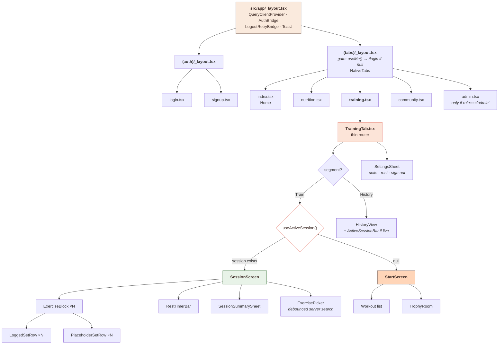
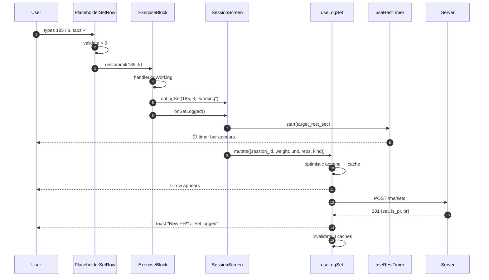
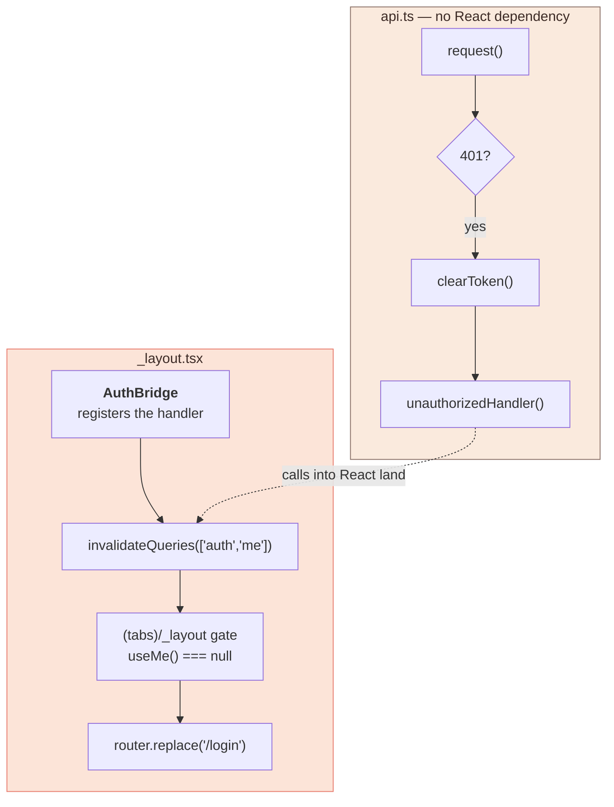

# Chapter 6 — Frontend Architecture

> **The organizing decision: there is no client state store.** No Redux, no Zustand, no
> context for domain data. The React Query cache *is* the state, and it's a replica of
> the server.
>
> That falls directly out of **S5**. If "am I mid-workout?" were a `useState` boolean,
> a dead battery would erase it. So the answer lives on the server, the client caches
> it, and there is nothing else to keep in sync.

---

## 6.0 Why the screen is one ternary

The single most consequential line in the frontend:

```tsx
{activeSession ? <SessionScreen session={activeSession} /> : <StartScreen />}
```

The old design had a three-way toggle — `Today | Workouts | History` — where "Today"
and a workout-detail modal were **two independent logging surfaces**. Jordan could log
bench from either one and see it in two places, which is **S9 broken at the UI layer**:
the app couldn't tell "the plan" from "what I did."

Making the screen a function of server state means there's no `isLogging` flag, no
`mode` enum, nothing that can disagree with the database. **S5 handed us the condition
for free, and it eliminated a class of UI bug in the process.**

---

## 6.1 Routing and the component tree



### `TrainingTab` is intentionally almost empty

It used to be 669 lines holding filters, a workout list, a trophy carousel, and three
view modes. Now it's ~120 lines that answer exactly one question:

```tsx
{view === "train" &&
  (isLoading ? <ActivityIndicator />
   : activeSession ? <SessionScreen session={activeSession} />
   : <StartScreen />)}
```

**This is the architecture, expressed as one ternary.** The presence of a session
decides the screen. There's no `isLogging` boolean, no `mode` state, nothing to get out
of sync — because the condition is server state, not local state.

Compare to the old design's three-way toggle (`Today | Workouts | History`), where
"Today" and the workout-detail modal were two independent logging surfaces. A user
could log the same exercise from both and see it in two places. The two-way split
(`Train | History`) plus session-driven branching makes that structurally impossible.

> ### 🎓 The transferable lesson
> When a component grows view-mode flags, ask whether the mode is *derivable from data
> you already have*. If it is, delete the flag. Derived state can't desynchronize;
> duplicated state always eventually does.

---

## 6.2 The cache is the state

```mermaid
graph TB
    subgraph keys["queryKeys — the entire client state namespace"]
        direction TB
        K1["<code>['auth','me']</code><br/>current user · staleTime 60s"]
        K2["<code>['exercises', filter]</code><br/>catalog · staleTime <b>1 hour</b>"]
        K3["<code>['workouts', filter]</code><br/>templates · staleTime 5 min"]
        K4["<code>['me','preferences']</code><br/>units · rest · staleTime 5 min"]
        K5["<code>['me','sessions','active']</code><br/><b>staleTime 0</b> — the hot one"]
        K6["<code>['me','sessions','list',from,to]</code><br/>history calendar"]
        K7["<code>['me','sessions', id]</code><br/>one session detail"]
        K8["<code>['me','prs']</code><br/>personal records"]
        K9["<code>['admin','workouts', …]</code><br/>staleTime 30s"]
    end

    style keys fill:#faeadd,stroke:#8b7268,color:#3d2b26
    style K5 fill:#fce4d8,stroke:#e87d6f,color:#3d2b26
    style K2 fill:#e8f3e8,stroke:#5a8a5a,color:#3d2b26
```



Every key lives in one object in [`queries.ts`](../src/lib/queries.ts):

```ts
export const queryKeys = {
  me: ["auth", "me"] as const,
  activeSession: ["me", "sessions", "active"] as const,
  session: (id: string) => ["me", "sessions", id] as const,
  sessions: (from?, to?) => ["me","sessions","list", from ?? null, to ?? null] as const,
  prs: ["me", "prs"] as const,
  // ...
};
```

**Why centralize?** Because invalidation is string matching, and a typo'd key is a
silent bug — the mutation "succeeds," nothing refetches, and the UI shows stale data
with no error. Centralizing means the compiler catches misuse and there's exactly one
place to audit.

Note the `as const` — it makes the arrays readonly tuples so TypeScript can catch a
key being accidentally mutated or mistyped.

### Prefix-based invalidation

React Query treats keys as hierarchical arrays, so a prefix invalidates a whole
subtree:

```ts
qc.invalidateQueries({ queryKey: ["me", "sessions", "list"] });
```

This invalidates `['me','sessions','list', '2026-08-01', '2026-08-31']` **and** every
other date range, without enumerating them. That matters because `HistoryView` creates
a new cache entry per month browsed — you can't know all the keys, but you can match
their prefix.

This is why `sessions()` puts `"list"` in the key at all. Without it,
`['me','sessions', from, to]` would collide with `['me','sessions', id]` in prefix
matching, and invalidating the list would also nuke every session detail. The literal
segment is a namespace separator.

### What gets invalidated on a set write

```ts
onSettled: () => {
  qc.invalidateQueries({ queryKey: queryKeys.activeSession });        // the screen
  qc.invalidateQueries({ queryKey: ["me", "sessions", "list"] });     // history totals
  qc.invalidateQueries({ queryKey: queryKeys.prs });                  // maybe a new PR
}
```

Three caches, because one set can change all three. Note it's `onSettled`, not
`onSuccess` — it runs on failure too, guaranteeing the client reconciles with the
server even after an error. On the error path the snapshot rollback already restored
the old value, and the refetch confirms it.

---

## 6.3 Data flow for logging one set



Two things to notice about the prop chain.

**Callbacks flow down, data flows up — no context.** `SessionScreen` owns the mutation
and the timer; `ExerciseBlock` and `SetRow` are nearly pure. That means `SetRow` can be
tested or reused without a QueryClient, and there's exactly one place that knows how to
log a set.

**The rest timer starts *before* the network call.** `onSetLogged()` fires on commit,
not on success. If it waited for the response, there'd be a visible lag between tapping
✓ and the timer starting — and on a bad connection the user would be resting for
seconds before the clock acknowledged it. Starting immediately matches the physical
reality (you finished the set *now*), and if the write fails the toast tells you while
the timer keeps running, which is the right call in a gym.

---

## 6.4 `SetRow`: two components, not one with a flag

> **The stories:** **S1** (log fast) needs the commit control to be a single
> unmissable tap. **S2** (beat last time) needs last session's numbers visible in the
> row *before* Jordan types anything.

```tsx
export function LoggedSetRow({ set, displayIndex, weightUnit, onUpdate, onDelete })
export function PlaceholderSetRow({ displayIndex, lastTime, weightUnit, kind, onCommit })
```

These could have been one component with `isLogged`. They're separate because their
props barely overlap and their behavior is genuinely different:

| | `LoggedSetRow` | `PlaceholderSetRow` |
|---|---|---|
| Has a server `id` | yes | no |
| Edit commits | `PATCH` on blur | — |
| Primary action | ✗ delete | ✓ commit |
| Shows | actual values | `lastTime` as placeholder |
| PR badge | maybe | never |

A merged component would be a thicket of `isLogged &&` branches with half the props
optional. Splitting them makes each one's contract obvious.

### The blur-commit guard

```tsx
const commitIfChanged = () => {
  const w = Number(weight);
  const r = Number(reps);
  if (!(w > 0) || !(r > 0)) {
    setWeight(displayWeight);   // revert invalid input
    setReps(String(set.reps));
    return;
  }
  if (w !== Number(displayWeight) || r !== set.reps) {
    onUpdate(w, r);             // only PATCH if actually different
  }
};
```

Without the change check, merely focusing and blurring a field fires a `PATCH` — which
triggers a server-side PR recomputation and three cache invalidations, for nothing.
Scrolling past a set with 8 exercises could fire dozens of pointless writes.

The invalid-input branch reverts rather than clamping. If a user clears the field and
taps away, showing the original value is less surprising than silently substituting
`0` or `1`.

### The prefill bug that was fixed

The old `ExerciseLogger` had this:

```tsx
useEffect(() => {
  if (todaysSets.length > 0 && weight === '') setWeight(String(lastWeight));
}, [todaysSets.length, lastWeight, weight]);   // ← `weight` in deps
```

Since `weight` is a dependency *and* the condition tests `weight === ''`, backspacing
the field to empty re-triggers the effect, which immediately refills it. **The input
was impossible to clear once a set existed.**

The new `PlaceholderSetRow` avoids the whole class of problem by never writing to
state on mount — the suggestion lives in `placeholder`, not `value`:

```tsx
<TextInput
  value={weight}                        // starts '' and stays '' until typed
  placeholder={suggestedWeight || '0'}  // the hint, not the value
/>
```

And "what to submit" is derived at commit time:

```tsx
const effectiveWeight = weight !== '' ? weight : suggestedWeight;
```

> ### 🎓 The transferable lesson
> **Prefer `placeholder` over pre-filled `value`** for suggestions. A pre-filled value
> is state you must now synchronize, reset, and detect edits against. A placeholder is
> zero state — the empty field genuinely means "the user hasn't typed anything," which
> is exactly what you want to know.

---

## 6.5 Debounced server search

> **The story:** **S9** — *"I skipped an exercise and added a different one."* Jordan is
> mid-workout with 60 seconds of rest left, and needs to find "incline dumbbell press"
> among 1,072 exercises.

The old version fetched all 1,072 rows and filtered in JS on every keystroke. The new
one:

```tsx
const [query, setQuery] = useState('');
const [debounced, setDebounced] = useState('');

useEffect(() => {
  const t = setTimeout(() => setDebounced(query.trim()), 250);
  return () => clearTimeout(t);
}, [query]);

const { data: exercises, isLoading } = useExercises({
  search: debounced || undefined,
  limit: 50,
});
```

The `clearTimeout` in the cleanup is the debounce: each keystroke cancels the pending
timer, so only a 250 ms pause actually fires. Type "bench" quickly and you get **one**
request, not five.

Then React Query does something clever for free — because `debounced` is part of the
query key via `queryKeys.exercises(filter)`, re-typing a previous search is an instant
cache hit with no network call at all.

The backend side already existed ([`exercises.py`](../backend/app/routers/exercises.py)):

```python
if q:
    pattern = f"%{q.lower()}%"
    stmt = stmt.where(or_(Exercise.name.ilike(pattern),
                          Exercise.muscle_group.ilike(pattern)))
```

---

## 6.6 Auth: two bridges in the root layout



`api.ts` is deliberately React-free — it's a plain transport module, testable in
isolation. But a 401 needs to trigger navigation, which is React's job. The bridge is
a registered callback:

```ts
// api.ts
let unauthorizedHandler: UnauthorizedHandler | null = null;
export function setUnauthorizedHandler(handler) { unauthorizedHandler = handler; }

// _layout.tsx
useEffect(() => {
  setUnauthorizedHandler(() => qc.invalidateQueries({ queryKey: queryKeys.me }));
  return () => setUnauthorizedHandler(null);
}, [qc]);
```

Note the defensive wrapping at the call site:

```ts
try { unauthorizedHandler(); }
catch { /* a failing handler must never mask the underlying ApiError */ }
```

If the handler throws, the caller still needs to see the real `ApiError`. Swallowing
the secondary failure preserves the primary one.

### `useMe` never throws

```ts
queryFn: async () => {
  const token = await getToken();
  if (!token) return null;
  try { return await api.me(); }
  catch (e) {
    if (e instanceof ApiError && e.status === 401) {
      await clearToken();
      return null;      // "not signed in" — a valid answer
    }
    throw e;            // "couldn't tell" — a real error
  }
}
```

This distinction is load-bearing for the gate. `null` means *definitely* not signed in
→ redirect to login. A thrown error means *we don't know* (server down, no Wi-Fi) →
show "Could not reach the server / Try again," **not** a login screen. Conflating them
would log users out every time the backend hiccups.

### The offline-logout bridge

```ts
onError: async () => {
  // Logout failed (likely offline). Mark as pending so the
  // LogoutRetryBridge in _layout.tsx will retry on app foreground.
  await AsyncStorage.setItem("@workout/pending-logout", "1");
},
onSettled: async () => {
  // Always clear local state — the user is heading to /login.
  await clearToken();
  qc.setQueryData(queryKeys.me, null);
  qc.removeQueries();
}
```

Sign out with no connection: the server-side session row survives, so the token is
technically still valid for 30 days. The local token is cleared regardless (the user
asked to leave, and honoring that immediately is correct), and a flag queues the
server-side revocation for the next app foreground.

`qc.removeQueries()` — not just `setQueryData(me, null)` — wipes the whole cache. Without
it, the next user to log in on this device would briefly see the previous user's
cached sessions and PRs. **That's a privacy bug, and one line prevents it.**

---

## 6.7 The one place the design is compromised

The plan called for a session bar floating above the tab bar on **every** tab.
`(tabs)/_layout.tsx` uses `NativeTabs` from `expo-router/unstable-native-tabs` — a real
native tab controller (UIKit / Android), not a JS view. Overlaying an
absolutely-positioned React view on top of it can't be verified without a device or
simulator.

Rather than ship an unverified layer, the implementation uses two mechanisms that rest
on documented APIs:

**1. A badge on the Training tab icon** — the official dynamic-`Trigger` pattern:

```tsx
// src/app/(tabs)/training.tsx
<NativeTabs.Trigger>
  <NativeTabs.Trigger.Badge hidden={!activeSession} />
</NativeTabs.Trigger>
```

**2. A resume bar inside Training's History view**, where `SessionScreen` isn't mounted:

```tsx
{activeSession && (
  <ActiveSessionBar session={activeSession} onPress={() => setView("train")} />
)}
```

The gap is honest and recorded in the component's own docstring:

```tsx
/**
 * This does NOT float above the native tab bar on every screen —
 * `NativeTabs` renders a real native tab controller, and overlaying an
 * absolutely-positioned JS view on top of it is not something that can be
 * verified without a device/simulator to test the actual compositing
 * behavior. Rather than ship an unverified layer, this renders only where a
 * session could otherwise go unnoticed...
 */
```

> ### 🎓 The transferable lesson
> When you can't verify something, the right move is a narrower solution you *can*
> verify, plus a written record of what was skipped and why. The failure mode to avoid
> is shipping the ambitious version untested and letting the next person discover it's
> broken — with no note explaining that it was never confirmed to work in the first
> place.

---

## Where to go next

[Chapter 7 — Testing & Verification](07-testing.md) — what's actually proven.
