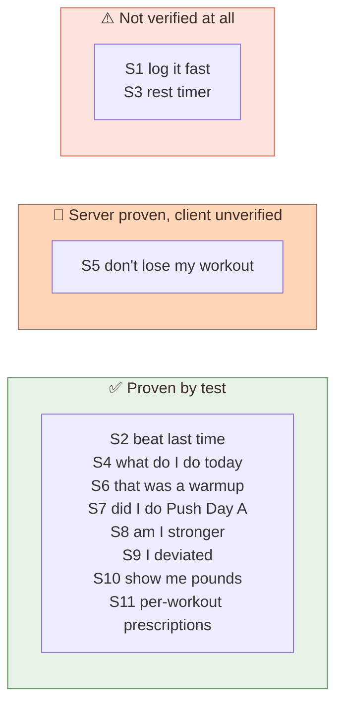
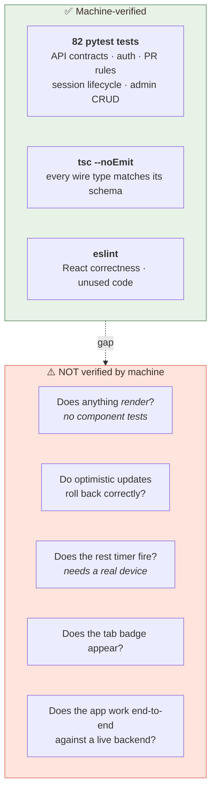
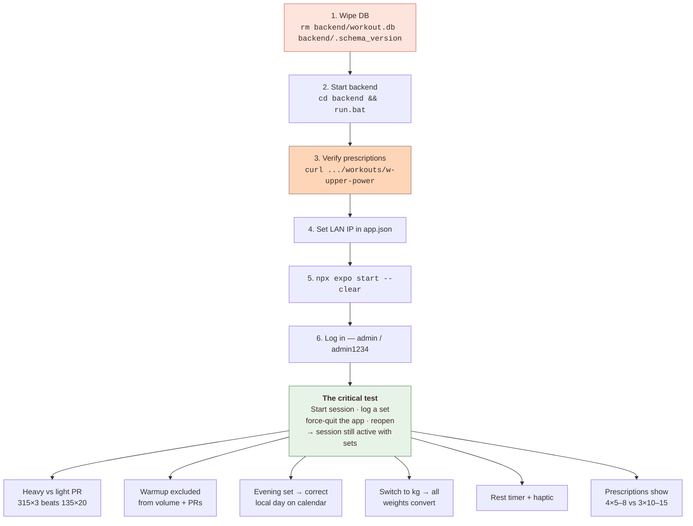

# Chapter 7 — Testing & Verification

> The uncomfortable question: **which of Jordan's eleven stories actually work, and
> which ones do we merely believe work?**
>
> A test suite's real job isn't line coverage — it's telling you which promises to the
> user you can keep.

---

## 7.0 Story coverage — the only table that matters



**Read that carefully, because the shape is uncomfortable: the two *highest-frequency*
stories are the two least verified.** S1 happens 30× per workout and S3 happens 30×
per workout, and neither has a single automated test — they're pure client-side
behavior, and there are no component tests.

Everything with a durable server consequence is well covered. Everything Jordan
*touches* is not. That's the honest risk profile, and §7.6's manual checklist exists
specifically to cover it.

---

## 7.1 What the pyramid actually looks like



**The backend is well covered. The frontend is type-checked but not behaviorally
tested.** That's the honest state. There are no component tests, no React Testing
Library, no Detox/Maestro E2E. `tsc` proves the *shapes* line up; it proves nothing
about behavior.

So: `SessionScreen` provably sends a correctly-shaped `SetLogCreate`. Whether tapping ✓
actually causes that to happen has only been reasoned about, not observed.

---

## 7.2 The backend suite

```bash
cd backend && .venv/Scripts/python.exe -m pytest -q
# 82 passed
```

| File | Tests | Covers |
|---|---|---|
| `test_auth.py` | 22 | signup, login, tokens, expiry, logout-all, rate limits |
| `test_api.py` | ~30 | exercises, workouts, prescriptions, prefs, sets, PRs, units |
| `test_admin.py` | 15 | workout CRUD, reorder, role gating |
| `test_sessions.py` | 17 | session lifecycle, blocks, last_time, stale sweep |

### The fixture design worth stealing

[`conftest.py`](../backend/tests/conftest.py) sets env vars **before** importing app
modules:

```python
os.environ["DATABASE__PATH_TEMPLATE"] = "sqlite:///:memory:"
os.environ["AUTH__BCRYPT_COST"] = "4"      # ~5ms instead of ~200ms
os.environ["WORKOUT_APP_TESTING"] = "1"    # disables the rate limiter
# ... then:
import pytest
from app.main import create_app
```

Ordering is mandatory — Pydantic Settings reads the environment at import time, so
setting these after the import would have no effect.

The bcrypt cost drop is why 82 tests run in **3.8 seconds**. At production cost 12,
each login would take ~200 ms, and a suite with dozens of logins would take a minute.
Same code path, different work factor.

`StaticPool` keeps one connection alive so `sqlite:///:memory:` persists across the
test's requests (a fresh connection would get an empty database):

```python
eng = create_engine("sqlite:///:memory:",
                    connect_args={"check_same_thread": False},
                    poolclass=StaticPool)
```

### Two levels of access

```python
@pytest.fixture
def seeded_client(seeded_engine): ...   # HTTP — tests the contract

@pytest.fixture
def db_session(seeded_engine): ...      # direct DB — forges impossible state
```

Most tests use `seeded_client` and go through HTTP, which is what you want: it tests
what clients actually experience.

`db_session` exists for state the API can't produce. The stale-session test needs a
session started 25 hours ago, and no endpoint lets you backdate one:

```python
ws = db_session.get(WorkoutSession, session_id)
ws.started_at = (datetime.now(timezone.utc) - timedelta(hours=25)).strftime(...)
db_session.commit()
```

> ### 🎓 The transferable lesson
> Prefer testing through your public interface — it survives refactoring. But keep a
> back door for time-dependent and error-path states, or you'll end up injecting
> clock abstractions everywhere just to make tests possible. One escape hatch beats
> pervasive indirection.

---

## 7.3 The tests that encode the *why*

Some tests exist to stop a specific past bug from coming back. These are the valuable
ones, because their names document which of Jordan's stories they're defending.

### The PR scoring bug — defends **S8**

```python
def test_log_set_best_weight_beats_best_volume(...):
    """A heavy low-rep set must win `best_weight_kg` over a
    higher-*volume* light set — the old `weight * reps` scoring let
    135x20 (2700) outrank 315x3 (945)."""
```

If someone "simplifies" `prs.py` back to a single volume score, this fails immediately
and the docstring explains what they broke. In Jordan's terms: it stops the app from
telling them their 315 bench wasn't a PR.

### The mixed-unit comparison — defends **S10** + **S8**

```python
def test_log_set_mixed_units_compare_on_kg(...):
    # 100 kg × 5, then 220 lb × 5 ≈ 99.79 kg — must NOT be a PR
    assert r.json()["is_pr"] is False
```

Guards the entire `weight_kg` design. Delete the canonical column and this test dies.
This is the test that stops "I switched to kilos and my PRs broke."

### Warmup exclusion — defends **S6**

```python
def test_log_set_warmup_excluded_from_pr_and_volume(...):
    # log 400 lb as a warmup
    assert r.json()["is_pr"] is False
    assert prs == []
    assert detail["total_sets"] == 0
    assert detail["total_volume_kg"] == 0.0
```

Four assertions because there are four independent places warmups must be filtered.
Any one regressing is a distinct way to break S6.

### The ordering bug this suite actually caught — defends **S9**

```python
def test_blocks_ad_hoc_session_ordered_by_first_logged(...):
    # log ex-squat first, then ex-bench
    assert ids == ["ex-squat", "ex-bench"]
```

**This one failed on first run** and exposed a real defect: `utc_now_iso()` has
second resolution, so both sets got identical timestamps and the sort silently
tie-broke alphabetically → `["ex-bench", "ex-squat"]`. The fix was ordering by the
autoincrement `id`. See [Chapter 3](03-data-model.md#why-order-by-id-not-timestamp).

Worth dwelling on: this bug was **invisible to code review** — the query looked
correct — and **obvious to a test**. It would have shipped as "sometimes the exercise
order is weird," which is nearly unreportable.

---

## 7.4 What broke when the schema changed, and why that was good

Bumping the schema deliberately broke 8 tests:

```
FAILED test_api.py::test_log_set_creates_history_and_pr - assert 422 == 201
FAILED test_api.py::test_history_date_filter - KeyError: 'history'
FAILED test_admin.py::test_admin_remove_exercise_from_workout - order mismatch
...
```

Each failure was informative:

| Failure | Meaning |
|---|---|
| `422` on `POST /me/sets` | `session_id` is now required — correct |
| `KeyError: 'history'` | `/me/history` is gone, replaced by `/me/sessions` — correct |
| `KeyError: 'set'` | response shape changed — correct |
| order mismatch | seed order changed (compounds first) — correct |

**Tests failing after an intentional breaking change is the system working.** The
danger sign would have been all 57 still passing — that would mean they weren't
actually testing the contract.

The order-mismatch failures deserve a note. The seed was reordered so compound lifts
come first:

```python
# Compounds: lower reps, longer rest.
{"id": "ex-bench", ...}, {"id": "ex-ohp", ...},
# Accessories: higher reps, shorter rest.
{"id": "ex-incline-db", ...},
```

Two tests hard-coded the old order. The fix was updating the expectation **and the
comment explaining it**:

```python
# Compounds (bench, ohp) first, then accessories — see
# `app/seed/workout_seeds.py`.
assert ids == ["ex-bench", "ex-ohp", "ex-incline-db", "ex-cable-fly", "ex-lateral"]
```

Without that comment, the next person sees a magic array and can't tell whether the
order is meaningful or incidental.

---

## 7.5 Frontend verification: what the two commands prove

```bash
npm run typecheck     # tsc --noEmit
npx expo lint
```

### What `tsc` proves

Because `src/lib/api.ts` mirrors `backend/app/schemas.py` by hand, the type checker
catches **contract drift at every consumer**. When `PersonalRecordResponse` changed
from `{weight, reps}` to `{best_weight_kg, best_weight_reps, ...}`, `tsc` immediately
flagged:

```
TrainingTab.tsx(408,39): error TS2339: Property 'weight' does not exist on
  type 'PersonalRecordResponse'.
ExerciseLogger.tsx(38,71): error TS2339: Property 'weight' does not exist...
```

That's a compile-time list of everything that needed updating — the mechanical
equivalent of grep, but sound.

**The limitation:** `api.ts` is hand-maintained. Nothing forces it to match the Python.
If the backend adds a field and TS isn't updated, the checker is happy and the field is
silently ignored. FastAPI publishes an OpenAPI schema at `/openapi.json`, so generating
these types is possible and would close the gap — a real improvement, not currently
done.

### What lint caught

Two genuine React bugs, both `react-hooks/set-state-in-effect` — `setState` called
synchronously in an effect body, causing cascading renders. Both were fixed properly
(see [Chapter 5](05-the-hard-parts.md#56-a-react-footgun-this-codebase-hit-twice))
rather than suppressed.

Remaining lint output is all **pre-existing** and in untouched files (`login.tsx`,
`DashboardTab.tsx`, `InterventionModal.tsx`, `use-color-scheme.web.ts`) — mostly
unescaped apostrophes. Every file this work touched is clean.

---

## 7.6 The manual checklist

These are the claims only a device can settle. In rough order of importance:



**Step 7 is the one that matters most.** Force-quit and reopen is the whole thesis of
this refactor. If the session survives, `WorkoutSession` is doing its job. If it
doesn't, nothing else in Chapter 1 is real.

**Step 10 (the timezone one) needs care:** log a set *after 7 PM local*. Before 7 PM
in a US timezone, UTC hasn't rolled over yet and the old bug wouldn't have shown
either — so an afternoon test proves nothing.

⚠️ **Step 1 is irreversible.** Bumping `schema_version` from 3 to 4 makes
`seed_if_schema_changed()` **delete `workout.db`** and re-seed. Every previously logged
set is gone and users are recreated from `defaults.yaml`. That was an accepted tradeoff
(it avoided writing Alembic migrations), but it is destructive and one-way.

---

## 7.7 Honest gaps

| Gap | Risk | Fix |
|---|---|---|
| No component tests | Medium — render bugs invisible to CI | React Testing Library on `SetRow`, `ExerciseBlock` |
| Optimistic rollback untested | Medium — only fires on network failure, i.e. rarely exercised and easy to get wrong | Mock a failing mutation, assert cache restored |
| Hand-written TS types | Medium — silent drift | Generate from `/openapi.json` |
| `ActiveSessionBar` overlay not attempted | Low — documented fallback in place | Verify on a device, then decide |
| One-active-session race | Low — needs ms-level double request | Partial unique index (Postgres) |
| `was_pr` drifts after edits | Low — cosmetic badge only | Store `best_weight_set_id` on the PR row |
| No Alembic | **High if deployed** | Add before any real deployment |

The last one is the only entry that would block going to production. Everything else is
a quality improvement; that one is a data-loss risk the moment there's data worth
keeping.

---

## 7.8 The summary table

Sorted by Jordan's story, because that's the unit that matters. A ⚠️ row means **we are
promising the user something we haven't confirmed.**

| Story | Claim | Status |
|---|---|---|
| **S1** | Logging feels instant | ⚠️ Unverified (no component tests) |
| **S1** | Failed writes roll back cleanly | ⚠️ Unverified |
| **S2** | `last_time` reads only prior sessions | ✅ Proven |
| **S3** | Rest timer fires, doesn't drift | ⚠️ Unverified — needs a device |
| **S4** | Prescriptions reach the session screen | ✅ Proven |
| **S5** | Session survives app restart | 🧪 Server proven; needs device confirmation |
| **S5** | Stale sessions auto-abandon at 24h | ✅ Proven |
| **S5** | Double-tap start doesn't duplicate | ✅ Proven |
| **S6** | Warmups excluded from PRs and volume | ✅ Proven |
| **S7** | Sessions are named, dated, durable | ✅ Proven |
| **S7** | Calendar shows the correct **local** day | ⚠️ Reasoned; needs an evening device test |
| **S8** | Heavy set beats high-volume set | ✅ Proven |
| **S8** | Editing a set recomputes PRs | ✅ Proven |
| **S8** | Deleting a session recomputes PRs | ✅ Proven |
| **S9** | Blocks order: prescribed then ad-hoc | ✅ Proven |
| **S10** | Mixed lb/kg compares correctly | ✅ Proven |
| **S11** | Prescriptions differ per workout | ✅ Proven |
| — | Anything renders at all | ⚠️ Unverified |

**The pattern:** every ✅ is a server-side consequence. Every ⚠️ is something Jordan
sees or touches. If you add one thing to this codebase, add component tests for S1 and
S3 — they're the two most-used features and the two least-proven.

---

## Where to go next

Back to [the index](README.md), or re-read [Chapter 1](01-what-the-lifter-needs.md) — it
reads differently once you've seen the rest.
