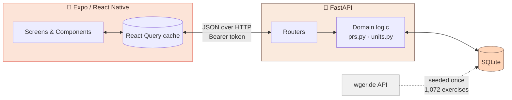

# Workout App — Architecture Course

A guided tour of how this app is built and, more importantly, **why**.

**The rule these notes follow:** nothing is justified by "good architecture." Every
table, endpoint, and component traces back to something a person standing in a gym is
trying to do. [Chapter 1](01-what-the-lifter-needs.md) establishes those needs as eleven
numbered user stories (**S1**–**S11**), and **every later chapter is accountable to
them** — sections open by naming the story they serve, and
[Chapter 7](07-testing.md) reports which stories are actually proven to work.

Read them in order. Each chapter states the user's need, shows the naive solution,
shows concretely why it breaks, then shows what the code does and what it cost.

If you read one chapter, read Chapter 1 — everything else is downstream of it.

---

## How to view this

You have three options, in increasing order of prettiness.

### Option A — just read the Markdown (zero setup)

Open any `.md` file in **VS Code** and hit `Ctrl+Shift+V` for the preview pane.
Mermaid diagrams render natively in VS Code's built-in preview as of v1.87, and on
GitHub. This is the fastest path and loses nothing.

### Option B — the browser viewer (nicest, ~5 seconds of setup)

There is a single-page viewer at `index.html` with a sidebar, rendered diagrams, and
proper typography. It loads the same `.md` files as Option A, so there is one source
of truth.

Browsers block `fetch()` of local files over `file://` (CORS), so it needs to be
served over HTTP. From **this** directory:

```bash
cd "C:/Python Projects/react_native_projects/workout_app/docuemntation"
python -m http.server 8080
```

Then open <http://localhost:8080/>. That's it — no npm install, no build step.
Press `Ctrl+C` in the terminal when you're done.

> If you open `index.html` directly by double-clicking, you will get an empty page
> and a CORS error in the console. That is expected. Use the server.

### Option C — the pre-rendered images (already done for you)

**All 26 diagrams are already rendered** into `diagrams/`, so you can browse or paste
them into a slide deck with no tooling at all:

```
diagrams/
  01-what-the-lifter-needs-1.svg   + .png   + .mmd   (source)
  01-what-the-lifter-needs-2.svg   + .png   + .mmd
  02-system-architecture-1.svg ...
  ...
  README-1.svg
```

- **`.svg`** — transparent background, scales infinitely. Best for docs and the web.
- **`.png`** — 2× resolution on the app's `#fdf6f0` background. Best for slides.
- **`.mmd`** — the extracted Mermaid source, if you want to tweak one.

Naming is `<chapter-file>-<n>`, where `n` is the diagram's position in that chapter.

#### Regenerating them

The renderer is **not** a project dependency (it pulls in Puppeteer/Chromium, which has
no business in an Expo app's manifest). Install it ad-hoc:

```bash
cd "C:/Python Projects/react_native_projects/workout_app"
npm install --no-save @mermaid-js/mermaid-cli
```

Then from `docuemntation/`, extract and render:

```bash
export PATH="$PATH:../node_modules/.bin"

# extract every ```mermaid block to diagrams/<file>-<n>.mmd
python - <<'PY'
import re, pathlib, os
os.makedirs('diagrams', exist_ok=True)
for p in sorted(pathlib.Path('.').glob('*.md')):
    for i, b in enumerate(re.findall(r'```mermaid\n(.*?)```', p.read_text(encoding='utf-8'), re.S), 1):
        (pathlib.Path('diagrams') / f"{p.stem}-{i}.mmd").write_text(b, encoding='utf-8')
PY

# render
for f in diagrams/*.mmd; do
  mmdc -i "$f" -o "${f%.mmd}.svg" -b transparent
  mmdc -i "$f" -o "${f%.mmd}.png" -b "#fdf6f0" -s 2
done
```

> Because `--no-save` was used, `package.json` and `package-lock.json` are untouched —
> but a future `npm ci` will remove `mmdc` from `node_modules`. Just re-run the install
> when you need it.

#### Validating diagram syntax

A Mermaid syntax error renders as an error box rather than failing loudly, so it's
worth checking after edits. `mmdc` exits non-zero on a bad diagram:

```bash
for f in diagrams/*.mmd; do
  mmdc -i "$f" -o /tmp/t.svg > /dev/null 2>&1 || echo "BROKEN: $f"
done
```

Two things this caught while these docs were written, both of which would have
silently rendered as error boxes:
- **Curly braces in `stateDiagram` transition labels** (`PATCH {status:"completed"}`)
  are a parse error — the `{` starts a composite-state block.
- **`PK-FK` is not valid `erDiagram` attribute-key syntax.** Only `PK`, `FK`, `UK`.

---

## Table of contents

| # | Chapter | Driven by | What you'll understand |
|---|---|---|---|
| 1 | [What The Lifter Needs](01-what-the-lifter-needs.md) | — | The 11 stories, and how 6 of them were unsatisfiable because of one missing noun |
| 2 | [From Stories to Architecture](02-system-architecture.md) | S1 vs S5 | How "instant" and "durable" conflict, and what resolving it forces |
| 3 | [The Data Model](03-data-model.md) | S6, S8, S10, S11 | Every column, and the story that forced it to exist |
| 4 | [The Session Lifecycle](04-session-lifecycle.md) | S5, S9 | Dead batteries, double-taps, and abandoned workouts |
| 5 | [The Hard Parts](05-the-hard-parts.md) | S1, S3, S7, S10 | The four features most easily built plausibly-but-wrong |
| 6 | [Frontend Architecture](06-frontend-architecture.md) | S1, S5 | Why there's no state store and the screen is one ternary |
| 7 | [Testing & Verification](07-testing.md) | all | **Which stories actually work, and which we only believe work** |

---

## The 60-second version

Jordan is in a gym with 90 seconds between sets. They need to log a set fast, see what
they lifted last time, not lose the workout when their phone dies, and get a straight
answer about whether they're getting stronger. That's the whole product.

Architecturally:



- The **server owns all state** (S5). The client caches it and may guess optimistically
  (S1), but never disagree.
- A **`WorkoutSession`** is the spine (S5, S7, S9). Every logged set belongs to exactly
  one.
- **Reference data** (exercises, prescriptions) is seeded and cached hard (S4).
  **User data** (sessions, sets, PRs) is written constantly and never stale (S1, S8).
- Comparisons happen in **kilograms**; display happens in Jordan's unit (S10).

---

## A note on the code references

Line numbers in these docs were accurate at the time of writing. If something
doesn't line up, trust the code — and if a chapter's *reasoning* no longer matches
the code, that's a bug in one of them worth chasing down.
